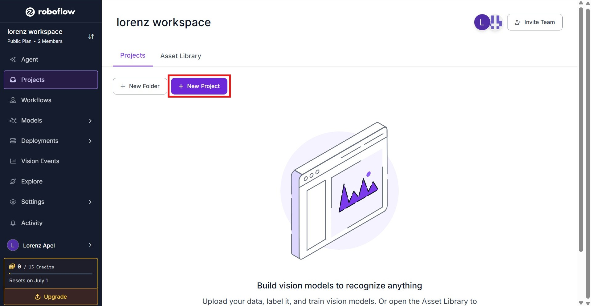
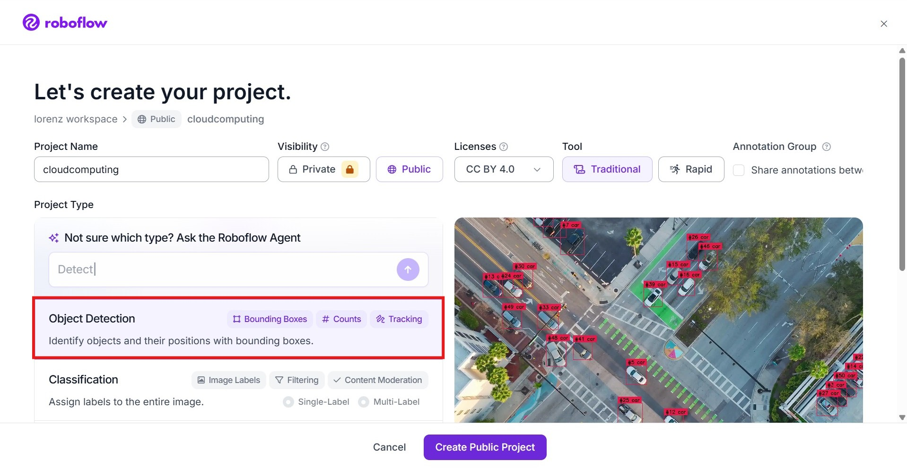
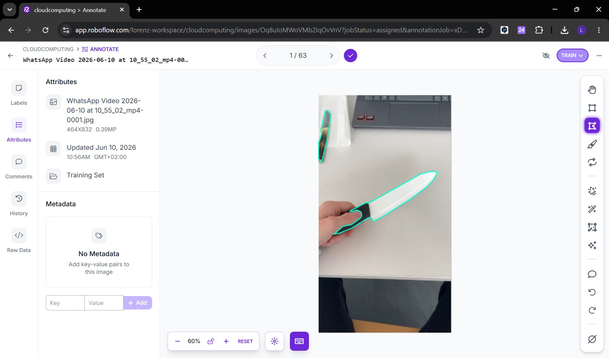
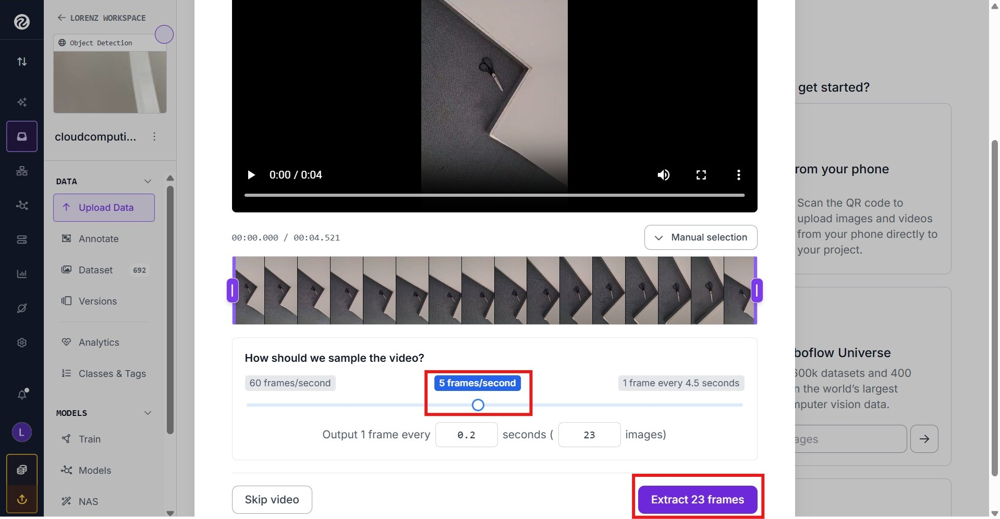
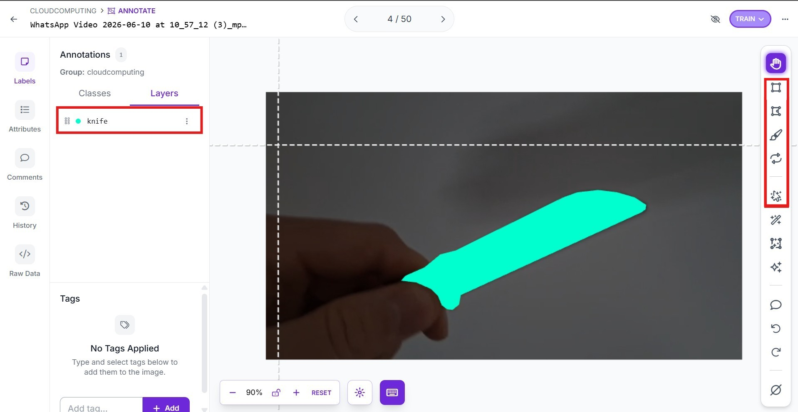
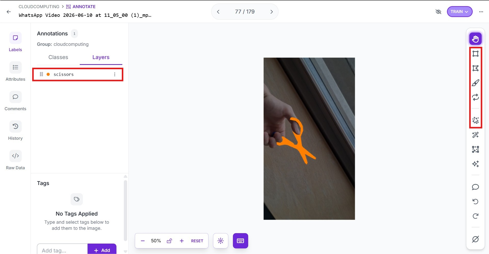
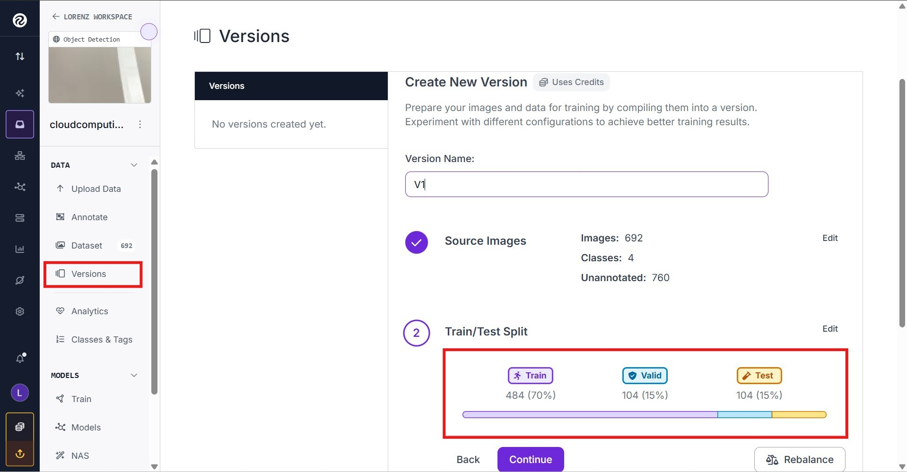
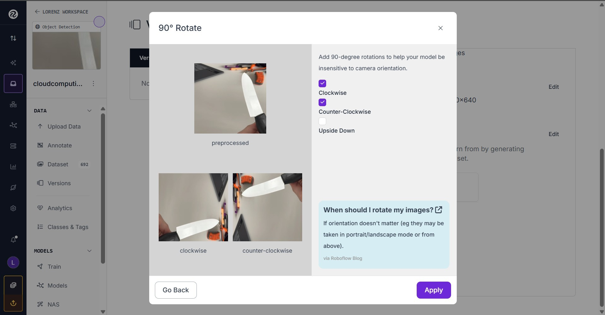
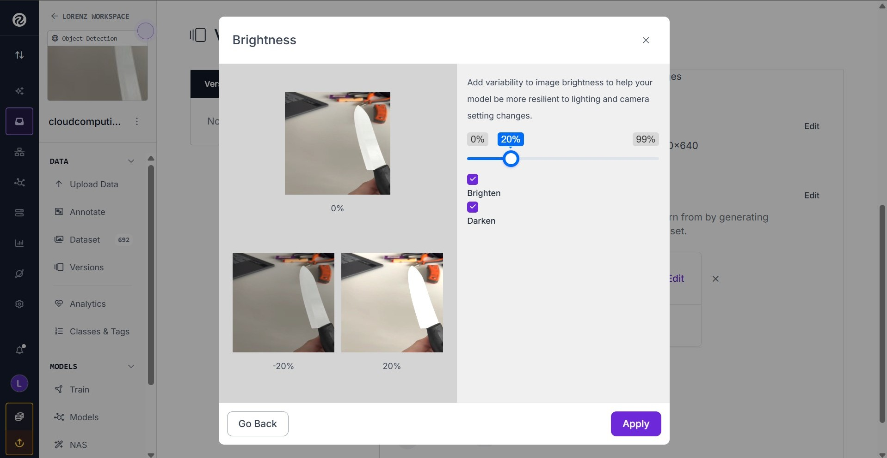
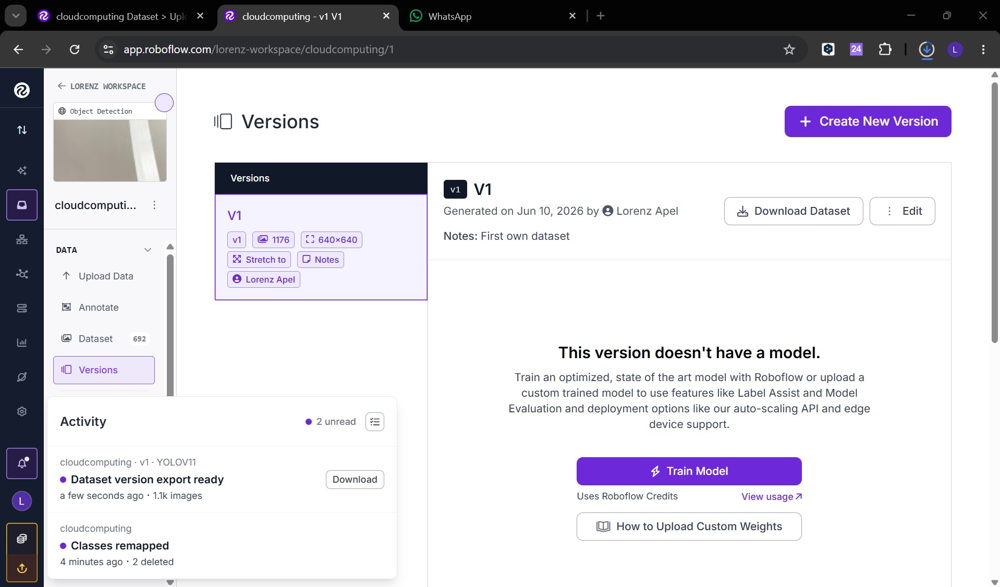

# KI-Modell & Objekterkennung

## Vorwort
In diesem Kapitel wird das KI-Modell, welches zur Erkennung von Gefahrenszenarien (Diebstahl, Vandalismus oder Feuer) verwendet wird, trainiert.

Dabei wird das YOLOV11 Modell in der Nanovariante benutzt. 

Zum trainieren wurden Datensätze aus dem Internet sowie eigene Bilder benutzt.

Das Labeln wurde mittels der Software Roboflow durchgeführt.

Hierbei gibt 4 Klassen:
- Feuer (Feuerzeug) --> Feuer
- Maske (FFP2, Sturmhaube) --> Diebstahl
- Schere (Küchenschere, Bastelschere) --> Vandalismus
- Messer (Küchenmesser, Taschenmesser, Cuttermesser...) --> Vandalismus 

## Datensatz erstellen
1. Video aufnehmen von Objekten
2. Roboflow login
3. Neues Projekt erstellen


4. Klassen erstellen

5. Upload der Videos und manuelles Labeling






6. Annotated Bilder dem Datensatz hinzufügen
7. Split nach 70,15,15

8. Preprocessing: 90° Rotation, Helligkeit 20% heller oder dunkler, Imagesize 640x640, Augmentation 2x




9. Export im YOLO11-Format in ZIP



## YOLO11n Training

## YOLO 11n Deployment auf IMX500 AI Camera (Raspberry PI Setup)

### Voraussetzungen
- Raspberry Pi 4B (8GB RAM) mit angeschlossener Raspberry Pi AI Camera mit Sony IMX500 Sensor
- Monitor + Tastatur oder ssh, vnc,... Zugriff auf Rasp Pi (im gleichen Netzwerk)
- trainiertes YOLO Modell v8n oder 11n im .pt Format

### pt2imx (in Google Colab)


Installiert man nur ultralytics (wie in offizieller doc: https://docs.ultralytics.com/integrations/sony-imx500#sony-model-compression-toolkit-mct), dann kann man sich stundenlang mit Konflikten rumschlagen oder man hat Glück und findet den Segen

https://www.reddit.com/r/raspberry_pi/comments/1r2j7le/illegal_instruction_error_with_yolov11_and_rpi4/ DANKE!!!

```
!pip install ultralytics
!pip install torch==2.3.1 torchvision==0.18.1 protobuf==7.35.0
```

eigenes YOLO Modell laden und exportieren...brauch nen Stück, deshalb am besten die Datensätze Train, Val (und optional test) verkleinern und als Kalibrierungsdaten dazugeben. Ich habe gute Erfahrungen mit 10 Bildern pro Datensatz gemacht, log empfiehlt >300

```
import os
import random
import shutil

path = "/content/dataset/data"  #Pfad anpassen

splits = ["train", "val", "test"]

keep_images = 10

for split in splits:
    split_path = os.path.join(path, split)

    if not os.path.exists(split_path):
        print(f"Skip: {split}")
        continue

    for class_name in os.listdir(split_path):
        class_path = os.path.join(split_path, class_name)

        if not os.path.isdir(class_path):
            continue

        images = [
            f for f in os.listdir(class_path)
            if f.lower().endswith((".jpg", ".jpeg", ".png", ".bmp", ".gif"))
        ]

        random.shuffle(images)

        remove_images = images[keep_images:]

        for img in remove_images:
            img_path = os.path.join(class_path, img)
            os.remove(img_path)

        print(f"{split}/{class_name}: kept {min(len(images), keep_images)} images")

print("Datensatz verkleinert.")
```

YOLO laden und export

```

from ultralytics import YOLO

model =YOLO("yolo11n.pt")

model.export(
    format="imx", #ai camera Format
    data"content/dataset/data.yaml", #Pfad anpassen und ggf. auch data.yaml
    device=0 #gpu nicht wesentlich, aber etwas schneller
```

zum Download in zip verpacken und anschließend aus Dateien (links) Herunterladen

```

import shutil

shutil.make_archive('yolo11n_imx', 'zip', '/content/yolo11n_imx_model')
     
```

nach dem Export folgende Struktur:
    yolo11n_imx_model <br/>
        ├── dnnParams.xml <br/>
        ├── labeles.txt <br/>
        ├── packerOut.zip <br/>
        ├── model_imx.onnx <br/>
        ├── model_imx_MemoryReport.json <br/>
        ├── model_imx.pbtxt <br/>
kopiere den Ordner später auf den Pi, wenn wir ihn brauchen (z.B. via USB, wget, scp,...)

### Raspberry Pi Setup (aufm Pi, NICHT in Colab)
Raspberry Pi OS installieren. WICHTIG: 64-bit und Bookworm (legacy) OS Lite für deploy, OS für dev

System aktualisieren und Firmware installieren

```
sudo apt update && sudo apt full-upgrade -y
sudo apt install imx500-all
```

optional vnc aktivieren, für GUI im dev)
```
sudo raspi-config
```
→ Interface Options → VNC Enable

erstelle venv
```
python3 -m venv --system-site-packages imx500-venv #--ssp damit Zugriff auf imx-all und andere globals
source imx500-venv/bin/activate
```

deploy Sony firmware

```
pip install --upgrade pip
pip install git+https://github.com/SonySemiconductorSolutions/aitrios-rpi-application-module-library.git
```

teste

```
rpicam-hello --version
```

Problem: libcamera 0.5.x → inkompatibel mit neueren modlib Versionen (libcamera 0.6+ → empfohlen), deshalb müssen wir etwas tricksen

```
pip uninstall modlib -y
pip install modlib==1.1.0
```

statt libcam hoch, modlib runter

Modell auf Pi kopieren z.B. wget mit Link

```
wget ...
unzip 11n_imx.zip -d 11n_imx_model
```

YOLO Inferenzscript

```

class YOLO(Model):

    def __init__(self):
        super().__init__(
            model_file="11n_imx_model/packerOut.zip",
            model_type=MODEL_TYPE.CONVERTED,
            color_format=COLOR_FORMAT.RGB,
            preserve_aspect_ratio=False,
        )

        self.labels = np.genfromtxt(
            "11n_imx_model/labels.txt",
            dtype=str,
            delimiter="\n",
        )

    def post_process(self, output_tensors):
        return pp_od_yolo_ultralytics(output_tensors)


device = AiCamera(frame_rate=16)  #eventuell auf 8 runter
model = YOLO()
device.deploy(model)

annotator = Annotator()

with device as stream:
    for frame in stream:

        detections = frame.detections[
            frame.detections.confidence > 0.55
        ]

        labels = [
            f"{model.labels[class_id]}: {score:.2f}"
            for _, score, class_id, _ in detections
        ]

        annotator.annotate_boxes(
            frame,
            detections,
            labels=labels,
            alpha=0.3,
            corner_radius=10,
        )

        frame.display()
```

Und rein da!

```
python3 run_yolo.py
```


        


