# Raspberry Pi Cluster Infrastructure and Remote Access

---

This documentation describes the infrastructure, network boot architecture, storage configuration, and remote administration of the Raspberry Pi cluster.

The cluster consists of one Raspberry Pi 5 Head Node and eight Raspberry Pi 3 Model B v1.2 Worker Nodes.

The Head Node provides the central infrastructure required by the workers, including:

- DHCP
- TFTP
- network boot
- NFS root filesystems
- shared storage
- Internet access
- remote administration through Tailscale

The Worker Nodes remain inside the private cluster network and are centrally managed through the Head Node.

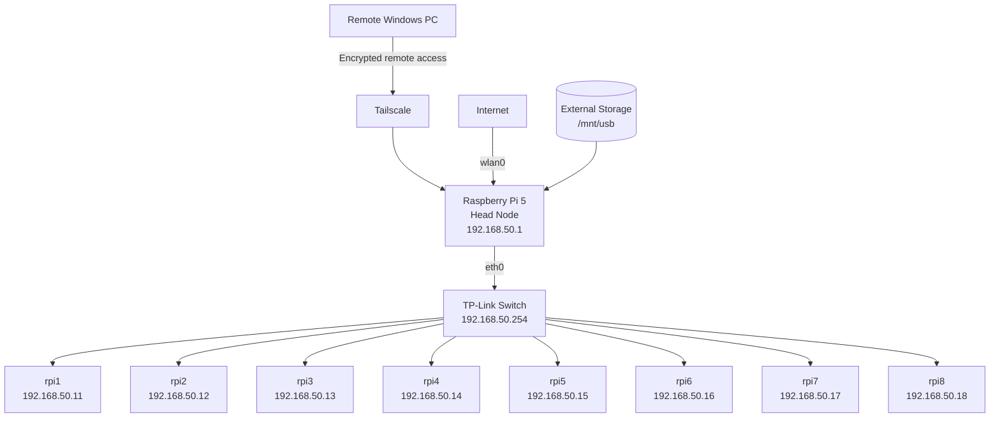

---

## Table of Contents

- [1. Infrastructure Overview](#1-infrastructure-overview)
  - [1.1 Hardware Architecture](#11-hardware-architecture)
  - [1.2 Network Architecture](#12-network-architecture)
  - [1.3 Switch Configuration](#13-switch-configuration)
- [2. Network Boot and Storage](#2-network-boot-and-storage)
  - [2.1 Worker Boot Media](#21-worker-boot-media)
  - [2.2 Storage Architecture](#22-storage-architecture)
  - [2.3 Worker Assignment](#23-worker-assignment)
  - [2.4 DHCP Configuration](#24-dhcp-configuration)
  - [2.5 TFTP Boot Architecture](#25-tftp-boot-architecture)
  - [2.6 NFS Root Filesystem Architecture](#26-nfs-root-filesystems)
- [3. Internet Access and Remote Administration](#3-internet-access-and-remote-administration)
  - [3.1 Internet Access for Worker Nodes](#31-internet-access-for-worker-nodes)
  - [3.2 Remote Access Concept](#32-remote-access-concept)
  - [3.3 Why Tailscale was used](#33-why-tailscale-was-used)
  - [3.4 Preparing the Head Node](#34-preparing-the-head-node)
  - [3.5 Installing Tailscale](#35-installing-tailscale)
  - [3.6 Connecting the Head Node to Tailscale](#36-connecting-the-head-node-to-tailscale)
  - [3.7 Verify Tailscale](#37-verifying-tailscale)
  - [3.8 Windows Client](#38-windows-client)
  - [3.9 SSH via Tailscale](#39-ssh-via-tailscale)
  - [3.10 Accessing the Worker Nodes Remotely](#310-accessing-the-worker-nodes-remotely)
  - [3.11 No Tailscale Subnet Router Required](#311-no-tailscale-subnet-router-required)
  - [3.12 Security Concept](#312-security-concept)
- [4. Verification and Troubleshooting](#4-verification-and-troubleshooting)
  - [4.1 Storage and Network Boot Services](#41-storage-and-network-boot-services)
  - [4.2 Monitoring the Worker Boot Process](#42-monitoring-the-worker-boot-process)
  - [4.3 Tailscale Verification](#43-tailscale-verification)
  - [4.4 SSH Troubleshooting](#44-ssh-troubleshooting)
  - [4.5 Worker Connectivity](#45-worker-connectivity)
- [5. Infrastructure Summary](#5-infrastructure-summary)

---

# 1. Infrastructure Overview

## 1.1 Hardware Architecture

The cluster consists of the following components:

| Component                | Configuration / Purpose                 |
|--------------------------|-----------------------------------------|
| Head Node                | Raspberry Pi 5                          |
| Worker Nodes             | 8 × Raspberry Pi 3 Model B v1.2         |
| Network Switch           | TP-Link managed switch                  |
| Switch Management IP     | `192.168.50.254`                        |
| Internal Cluster Network | `192.168.50.0/24`                       |
| Head Node Address        | `192.168.50.1`                          |
| External Storage         | Approximately 29.8 GB                   |
| Storage Mount Point      | `/mnt/usb`                              |
| Worker Boot Media        | FAT32 MicroSD cards with `bootcode.bin` |
| Remote Access            | Tailscale + SSH                         |

The Raspberry Pi 5 acts as the central infrastructure server.

Its main responsibilities are:

- assigning network configurations to Worker Nodes,
- providing network boot files,
- providing NFS root filesystems,
- providing shared storage,
- routing Internet traffic,
- acting as the central remote administration entry point.

The Worker Nodes perform their operating system boot through the network.

They do not require a complete local operating system installation on their MicroSD cards.

---

## 1.2 Network Architecture

The cluster uses the private network:

```text
192.168.50.0/24
```

The Head Node uses:

```text
192.168.50.1
```

The switch management interface uses:

```text
192.168.50.254
```

The Worker Nodes use:

```text
rpi1 -> 192.168.50.11
rpi2 -> 192.168.50.12
rpi3 -> 192.168.50.13
rpi4 -> 192.168.50.14
rpi5 -> 192.168.50.15
rpi6 -> 192.168.50.16
rpi7 -> 192.168.50.17
rpi8 -> 192.168.50.18
```

The main network interfaces on the Head Node have different responsibilities:

| Interface    | Purpose                                 |
|--------------|-----------------------------------------|
| `eth0`       | Internal cluster network                |
| `wlan0`      | Internet connection                     |
| `tailscale0` | Remote administration through Tailscale |

The internal cluster network remains separate from remote access.

Only the Head Node is remotely accessible through Tailscale.

The Worker Nodes remain inside the private `192.168.50.0/24` network.

---

## 1.3 Switch Configuration

A TP-Link switch connects the Head Node and all Worker Nodes.

Its management address is:

```text
192.168.50.254
```

STP PortFast was enabled on the edge ports connected to the Raspberry Pis.

This is useful for the network boot environment because a Worker Node must be able to communicate with the network immediately after startup.

Without an edge-port configuration, spanning-tree initialization could introduce an unnecessary delay before DHCP and TFTP traffic becomes possible.

---

# 2. Network Boot and Storage

The Worker Nodes use a network-based boot architecture.

Instead of maintaining eight independent operating system installations, the Head Node stores and provides the required boot files and root filesystems centrally.

The general boot sequence is:

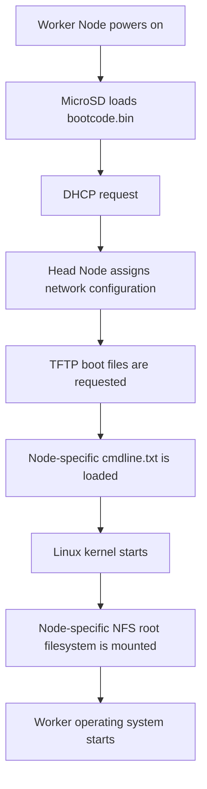

---

## 2.1 Worker Boot Media

Each Raspberry Pi 3 contains a FAT32-formatted MicroSD card.

The MicroSD card contains only the firmware file:

```text
bootcode.bin
```

The purpose of the card is to start the Raspberry Pi network boot process.

The actual Linux operating system is stored on the Head Node and accessed through the network.

This allows the Worker Nodes to be administered centrally.

---

## 2.2 Storage Architecture

The external storage used for the cluster infrastructure is attached to the Head Node.

The documented block device is:

```text
/dev/sda1
```

with a capacity of approximately:

```text
29.8 GB
```

It is mounted at:

```text
/mnt/usb
```

The storage contains:

- TFTP files,
- individual Worker Node root filesystems,
- shared scratch space.

The directory structure is:

```text
/mnt/usb/
├── tftpboot/
├── scratch/
├── rpi1/
├── rpi2/
├── rpi3/
├── rpi4/
├── rpi5/
├── rpi6/
├── rpi7/
└── rpi8/
```

Each Worker Node therefore has its own root filesystem.

For example:

```text
/mnt/usb/rpi1
```

belongs to `rpi1`, while:

```text
/mnt/usb/rpi8
```

belongs to `rpi8`.

The shared directory:

```text
/mnt/usb/scratch
```

is available as common storage.

---

## 2.3 Worker Assignment

The Worker Nodes are identified through their physical Ethernet MAC addresses.

A board-specific serial number is additionally used to select the corresponding TFTP directory.

| Hostname | IP Address      | MAC Address         | TFTP Directory |
|----------|-----------------|---------------------|----------------|
| `rpi1`   | `192.168.50.11` | `b8:27:eb:84:e2:d1` | `4784e2d1`     |
| `rpi2`   | `192.168.50.12` | `b8:27:eb:bd:4a:b1` | `c5bd4ab1`     |
| `rpi3`   | `192.168.50.13` | `b8:27:eb:6f:54:ca` | `006f54ca`     |
| `rpi4`   | `192.168.50.14` | `b8:27:eb:bc:ec:67` | `86bcec67`     |
| `rpi5`   | `192.168.50.15` | `b8:27:eb:23:95:78` | `c8239578`     |
| `rpi6`   | `192.168.50.16` | `b8:27:eb:6c:70:7e` | `486c707e`     |
| `rpi7`   | `192.168.50.17` | `b8:27:eb:90:08:15` | `2e900815`     |
| `rpi8`   | `192.168.50.18` | `b8:27:eb:c5:22:2c` | `4dc5222c`     |

This creates a fixed mapping between:

```text
physical Worker
        |
        +--> hostname
        +--> IP address
        +--> TFTP directory
        +--> NFS root filesystem
```

---

## 2.4 DHCP Configuration

The Head Node runs an authoritative ISC DHCP server.

The configuration file is:

```text
/etc/dhcp/dhcpd.conf
```

The DHCP server is responsible for:

- assigning fixed IP addresses,
- assigning hostnames,
- identifying the Worker Nodes by MAC address,
- providing the TFTP server address,
- providing the parameters required for network boot.

The configured DHCP file is:

```text
ddns-update-style none;
authoritative;
log-facility local7;

option option-43 code 43 = text;
option option-66 code 66 = text;

subnet 10.3.31.0 netmask 255.255.255.0 {}

group {
    option broadcast-address 192.168.50.255;
    option routers 192.168.50.1;
    default-lease-time 600;
    max-lease-time 7200;
    option domain-name "cluster";
    option domain-name-servers 8.8.8.8, 8.8.4.4;

    subnet 192.168.50.0 netmask 255.255.255.0 {
        range 192.168.50.20 192.168.50.250;

        host cluster {
            hardware ethernet 88:a2:9e:b0:ba:e3;
            fixed-address 192.168.50.1;
        }

        host switch {
            hardware ethernet 8c:86:dd:44:82:bd;
            fixed-address 192.168.50.254;
        }

        host rpi1 {
            option root-path "/mnt/usb/tftpboot/";
            hardware ethernet b8:27:eb:84:e2:d1;
            option option-43 "Raspberry Pi Boot";
            option option-66 "192.168.50.1";
            next-server 192.168.50.1;
            fixed-address 192.168.50.11;
            option host-name "rpi1";
        }

        host rpi2 {
            option root-path "/mnt/usb/tftpboot/";
            hardware ethernet b8:27:eb:bd:4a:b1;
            option option-43 "Raspberry Pi Boot";
            option option-66 "192.168.50.1";
            next-server 192.168.50.1;
            fixed-address 192.168.50.12;
            option host-name "rpi2";
        }

        host rpi3 {
            option root-path "/mnt/usb/tftpboot/";
            hardware ethernet b8:27:eb:6f:54:ca;
            option option-43 "Raspberry Pi Boot";
            option option-66 "192.168.50.1";
            next-server 192.168.50.1;
            fixed-address 192.168.50.13;
            option host-name "rpi3";
        }

        host rpi4 {
            option root-path "/mnt/usb/tftpboot/";
            hardware ethernet b8:27:eb:bc:ec:67;
            option option-43 "Raspberry Pi Boot";
            option option-66 "192.168.50.1";
            next-server 192.168.50.1;
            fixed-address 192.168.50.14;
            option host-name "rpi4";
        }

        host rpi5 {
            option root-path "/mnt/usb/tftpboot/";
            hardware ethernet b8:27:eb:23:95:78;
            option option-43 "Raspberry Pi Boot";
            option option-66 "192.168.50.1";
            next-server 192.168.50.1;
            fixed-address 192.168.50.15;
            option host-name "rpi5";
        }

        host rpi6 {
            option root-path "/mnt/usb/tftpboot/";
            hardware ethernet b8:27:eb:6c:70:7e;
            option option-43 "Raspberry Pi Boot";
            option option-66 "192.168.50.1";
            next-server 192.168.50.1;
            fixed-address 192.168.50.16;
            option host-name "rpi6";
        }

        host rpi7 {
            option root-path "/mnt/usb/tftpboot/";
            hardware ethernet b8:27:eb:90:08:15;
            option option-43 "Raspberry Pi Boot";
            option option-66 "192.168.50.1";
            next-server 192.168.50.1;
            fixed-address 192.168.50.17;
            option host-name "rpi7";
        }

        host rpi8 {
            option root-path "/mnt/usb/tftpboot/";
            hardware ethernet b8:27:eb:c5:22:2c;
            option option-43 "Raspberry Pi Boot";
            option option-66 "192.168.50.1";
            next-server 192.168.50.1;
            fixed-address 192.168.50.18;
            option host-name "rpi8";
        }
    }
}
```

After changing the configuration, restart the DHCP server:

```bash
sudo systemctl restart isc-dhcp-server
```

Check its status:

```bash
sudo systemctl status isc-dhcp-server
```

---

## 2.5 TFTP Boot Architecture

The TFTP root is:

```text
/mnt/usb/tftpboot/
```

The files must be readable by the Raspberry Pi boot firmware.

The documented permissions are:

```bash
sudo chmod -R 755 /mnt/usb/tftpboot/
```

Each Worker Node uses its own serial-number directory:

```text
/mnt/usb/tftpboot/
├── 4784e2d1/   # rpi1
├── c5bd4ab1/   # rpi2
├── 006f54ca/   # rpi3
├── 86bcec67/   # rpi4
├── c8239578/   # rpi5
├── 486c707e/   # rpi6
├── 2e900815/   # rpi7
└── 4dc5222c/   # rpi8
```

Each worker-specific directory contains a corresponding:

```text
cmdline.txt
```

The file passes the required Linux kernel parameters and specifies which NFS root filesystem should be mounted.

Example for `rpi1`:

```text
console=serial0,115200 console=tty1 root=/dev/nfs nfsroot=192.168.50.1:/mnt/usb/rpi1,vers=3 rw ip=dhcp rootwait elevator=deadline
```

The important NFS parameter is:

```text
nfsroot=192.168.50.1:/mnt/usb/rpi1,vers=3
```

For the other Worker Nodes, the path is changed accordingly:

```text
/mnt/usb/rpi2
/mnt/usb/rpi3
/mnt/usb/rpi4
/mnt/usb/rpi5
/mnt/usb/rpi6
/mnt/usb/rpi7
/mnt/usb/rpi8
```

---

## 2.6 NFS Root Filesystems

The Head Node provides the Worker Node root filesystems through NFS.

The NFS configuration is stored in:

```text
/etc/exports
```

The configured exports are:

```text
/mnt/usb/scratch 192.168.50.0/24(rw,sync)

/mnt/usb/rpi1 192.168.50.0/24(rw,sync,no_subtree_check,no_root_squash)
/mnt/usb/rpi2 192.168.50.0/24(rw,sync,no_subtree_check,no_root_squash)
/mnt/usb/rpi3 192.168.50.0/24(rw,sync,no_subtree_check,no_root_squash)
/mnt/usb/rpi4 192.168.50.0/24(rw,sync,no_subtree_check,no_root_squash)
/mnt/usb/rpi5 192.168.50.0/24(rw,sync,no_subtree_check,no_root_squash)
/mnt/usb/rpi6 192.168.50.0/24(rw,sync,no_subtree_check,no_root_squash)
/mnt/usb/rpi7 192.168.50.0/24(rw,sync,no_subtree_check,no_root_squash)
/mnt/usb/rpi8 192.168.50.0/24(rw,sync,no_subtree_check,no_root_squash)
```

The configuration uses:

```text
no_root_squash
```

for the Worker Node root filesystems.

This allows root operations from the worker operating systems and is required by the implemented network-root environment for system initialization and administration.

After changing `/etc/exports`, reload the NFS configuration:

```bash
sudo exportfs -ra
```

Display the active exports:

```bash
sudo exportfs -v
```

---

# 3. Internet Access and Remote Administration

The Head Node acts as the central connection point between the private Worker Network, the Internet, and remote administrators.

The basic architecture is:

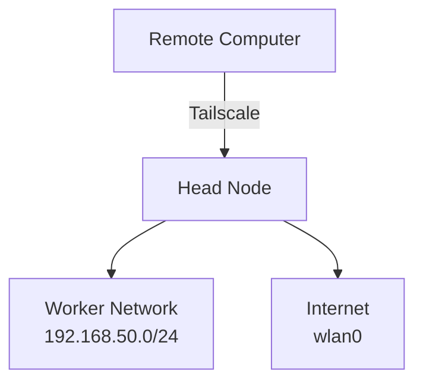

The Worker Nodes do not need to be directly exposed to the public Internet.

---

## 3.1 Internet Access for Worker Nodes

The Worker Nodes use the Raspberry Pi 5 as their gateway.

The Head Node forwards traffic between:

```text
eth0
```

and:

```text
wlan0
```

NAT was configured using `iptables`.

Enable address translation:

```bash
sudo iptables -t nat -A POSTROUTING \
  -s 192.168.50.0/24 \
  -o wlan0 \
  -j MASQUERADE
```

Allow outgoing traffic from the Worker Network:

```bash
sudo iptables -A FORWARD \
  -s 192.168.50.0/24 \
  -i eth0 \
  -o wlan0 \
  -j ACCEPT
```

Allow established response traffic:

```bash
sudo iptables -A FORWARD \
  -d 192.168.50.0/24 \
  -i wlan0 \
  -o eth0 \
  -m state \
  --state RELATED,ESTABLISHED \
  -j ACCEPT
```

This allows the Worker Nodes to access Internet services while keeping them inside the private network.

Connectivity can be tested from a Worker Node using:

```bash
ping -c 2 8.8.8.8
ping -c 2 deb.debian.org
sudo apt update
```

No inbound port forwarding to the Worker Nodes is required.

---

## 3.2 Remote Access Concept

Remote access was introduced so that the cluster could be administered without requiring physical access to the hardware.

Previously, the cluster had to be physically assembled and accessed locally.

For remote operation and automated workloads, the Head Node needed to remain accessible from outside the local network.

Tailscale was therefore introduced.

Only the Head Node is connected to Tailscale.

The Worker Nodes remain exclusively inside:

```text
192.168.50.0/24
```

The resulting access path is:

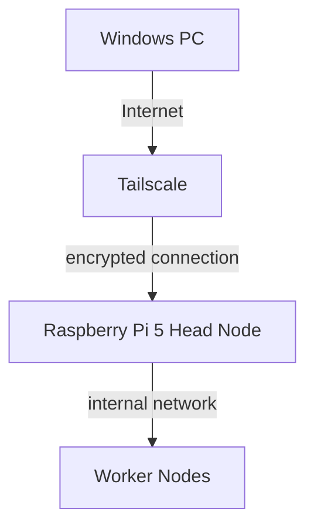

This makes the Head Node the central entry point for remote cluster administration.

---

## 3.3 Why Tailscale Was Used

Tailscale provides a private encrypted overlay network between authorized devices.

Using this architecture avoids the need for:

- SSH port forwarding on the router,
- direct public exposure of TCP port 22,
- a static public IPv4 address,
- Dynamic DNS,
- a separately hosted public VPN server,
- direct Internet exposure of the Worker Nodes.

The existing internal network therefore did not need to be redesigned for remote administration.

---

## 3.4 Preparing the Head Node

Before installing Tailscale, the local package information was updated:

```bash
sudo apt update
```

The required tools were installed:

```bash
sudo apt install lsb-release curl -y
```

The packages have the following purposes:

| Package       | Purpose                                                     |
|---------------|-------------------------------------------------------------|
| `curl`        | Downloads files and repository information using HTTP/HTTPS |
| `lsb-release` | Provides information about the installed Linux distribution |

The `-y` option automatically confirms the package installation.

---

## 3.5 Installing Tailscale

Tailscale was installed using the official Tailscale APT repository.

The package source from:

```text
pkgs.tailscale.com
```

was added to the Head Node.

The corresponding repository signing key was also installed so that APT can verify downloaded Tailscale packages.

After adding the repository, the package information was updated:

```bash
sudo apt update
```

Tailscale was then installed:

```bash
sudo apt install tailscale -y
```

The original project documentation does not contain the exact shell commands used to add the Tailscale repository and repository signing key. For that reason, those commands are not reproduced here.

---

## 3.6 Connecting the Head Node to Tailscale

After installation, Tailscale was activated using:

```bash
sudo tailscale up
```

The command generates an authentication URL.

This URL is opened in a web browser.

The Raspberry Pi is then authorized using the corresponding Tailscale account.

After successful authentication, the Head Node becomes part of the private Tailscale network.

Tailscale creates an additional virtual network interface:

```text
tailscale0
```

The Tailscale address is separate from the Head Node's internal address:

```text
192.168.50.1
```

---

## 3.7 Verifying Tailscale

The current Tailscale status can be checked using:

```bash
tailscale status
```

A successful entry has a structure similar to:

```text
100.x.x.x    raspberrypi    <account>    linux    -
```

The Head Node's Tailscale IPv4 address can be displayed directly using:

```bash
tailscale ip -4
```

The virtual interface can also be inspected using:

```bash
ip -br addr show tailscale0
```

The Tailscale IP is used for remote connections instead of the private cluster address.

---

## 3.8 Windows Client

Tailscale is also installed on the remote Windows computer.

The Windows system is authenticated into the same private Tailscale network as the Head Node.

The Windows PC and Raspberry Pi do not need to be connected to the same physical network.

The Windows computer can therefore access the Head Node while connected through:

- another Wi-Fi network,
- another local network,
- or a mobile Internet connection.

The logical connection is:

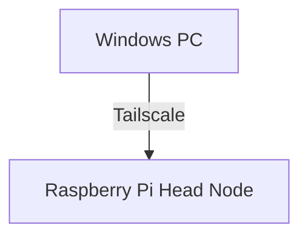

---

## 3.9 SSH via Tailscale

Standard OpenSSH is used for administration.

Tailscale provides the encrypted network connection, while SSH provides the remote shell.

From Windows PowerShell, the connection is started using:

```powershell
ssh cloud-computing@<TAILSCALE-IP>
```

For example:

```powershell
ssh cloud-computing@100.x.x.x
```

Here:

```text
cloud-computing
```

is the username on the Head Node.

During the first SSH connection, OpenSSH displays a message similar to:

```text
The authenticity of host '<IP>' can't be established.
ED25519 key fingerprint is ...
Are you sure you want to continue connecting (yes/no/[fingerprint])?
```

After verifying the fingerprint, the connection can be accepted using:

```text
yes
```

The SSH host key is then stored in the Windows client's `known_hosts` file.

Future SSH connections can compare the server identity with the stored key.

---

## 3.10 Accessing the Worker Nodes Remotely

The Worker Nodes do not run Tailscale themselves.

Remote administration therefore follows two steps:

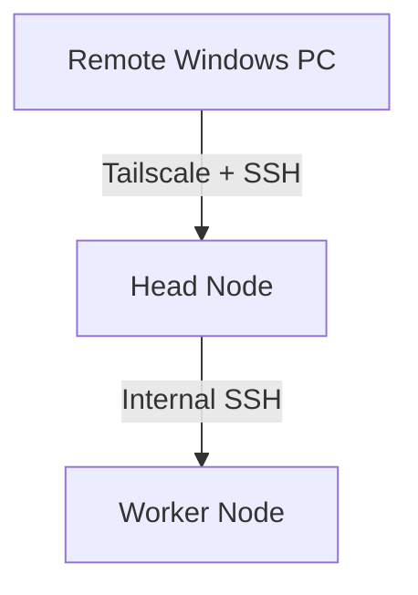

After connecting to the Head Node, the Worker Nodes can be reached through their internal hostnames.

Examples:

```bash
ssh rpi1
```

```bash
ssh rpi2
```

or using their internal IP addresses:

```bash
ssh pi@192.168.50.11
```

The Head Node therefore acts as a central administrative jump point into the private Worker Network.

---

## 3.11 No Tailscale Subnet Router Required

Tailscale supports a feature called a Subnet Router.

A Subnet Router could advertise:

```text
192.168.50.0/24
```

to other Tailscale clients.

This would allow remote systems to access Worker Node IP addresses directly through Tailscale.

This functionality was not required for the implemented architecture.

The required access model is only:

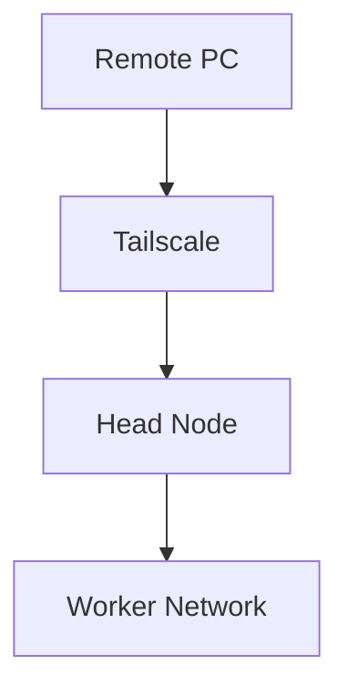

The Worker Nodes remain behind the Head Node.

This keeps the remote-access configuration simple and avoids exposing the complete internal subnet through Tailscale.

---

## 3.12 Security Concept

The Head Node does not need to expose its SSH service directly to the public Internet using router port forwarding.

The following architecture is therefore avoided:

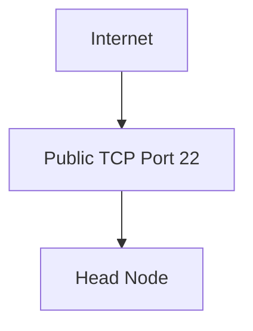

Instead, remote access uses:

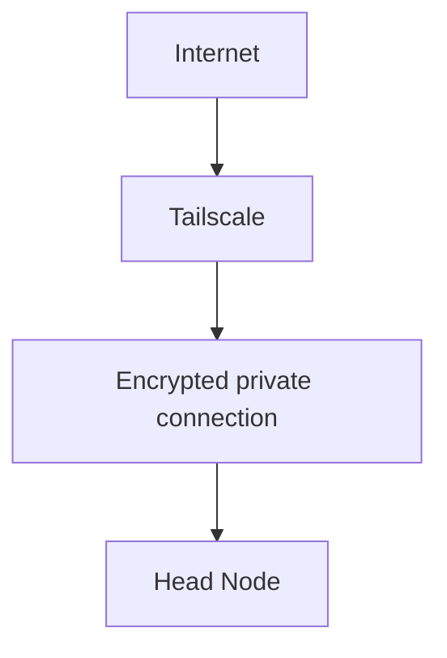

The advantages are:

- no public SSH port forwarding,
- no static public IPv4 requirement,
- no Dynamic DNS requirement,
- encrypted remote communication,
- access restricted to authorized Tailscale devices,
- Worker Nodes remain in the private network.

The existing DHCP, TFTP, and NFS infrastructure therefore remains internal.

---

# 4. Verification and Troubleshooting

The infrastructure can be checked from the Raspberry Pi 5 Head Node using a small set of diagnostic commands.

---

## 4.1 Storage and Network Boot Services

Check whether the external storage is mounted:

```bash
df -h /mnt/usb
```

Inspect its directory structure:

```bash
ls -lah /mnt/usb
```

Display storage usage:

```bash
sudo du -xh --max-depth=1 /mnt/usb | sort -h
```

Check the DHCP server:

```bash
sudo systemctl status isc-dhcp-server
```

Restart DHCP if required:

```bash
sudo systemctl restart isc-dhcp-server
```

Check the TFTP server:

```bash
sudo systemctl status tftpd-hpa
```

Inspect the TFTP directory:

```bash
ls -lah /mnt/usb/tftpboot/
```

Check the NFS server:

```bash
sudo systemctl status nfs-kernel-server
```

Display active NFS exports:

```bash
sudo exportfs -v
```

Reload the exports:

```bash
sudo exportfs -ra
```

---

## 4.2 Monitoring the Worker Boot Process

DHCP and TFTP network traffic can be observed directly using:

```bash
sudo tcpdump \
  -i eth0 \
  -n \
  port 67 or port 68 or port 69
```

A normal Worker Node boot should show:

```text
1. Worker sends DHCP request
2. Head Node responds with network configuration
3. Worker requests TFTP files
4. Linux kernel starts
5. Worker mounts its NFS root filesystem
6. Worker becomes reachable through the internal network
```

After startup, a Worker Node can be tested using:

```bash
ping 192.168.50.11
```

and:

```bash
ssh rpi1 hostname
```

---

## 4.3 Tailscale Verification

Check the Tailscale connection:

```bash
tailscale status
```

Display the Head Node's Tailscale IPv4 address:

```bash
tailscale ip -4
```

Inspect the Tailscale interface:

```bash
ip -br addr show tailscale0
```

From the Windows client, test SSH access using:

```powershell
ssh cloud-computing@<TAILSCALE-IP>
```

---

## 4.4 SSH Troubleshooting

During the initial Tailscale configuration, the Head Node became reachable through Tailscale before SSH login was fully working.

An observed message was:

```text
Connection closed by <TAILSCALE-IP> port 22
```

At this stage, the Tailscale connection itself was already established and TCP port 22 was reachable.

The remaining troubleshooting therefore concerned the SSH service or SSH configuration.

Check the SSH service:

```bash
sudo systemctl status ssh
```

Inspect SSH logs:

```bash
sudo journalctl -u ssh
```

A useful troubleshooting distinction is:

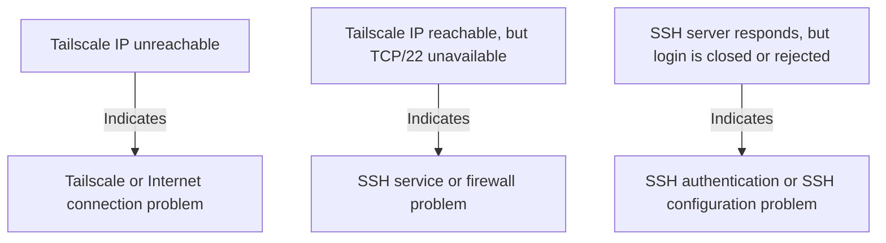

---

## 4.5 Worker Connectivity

After the Worker Nodes have booted, they can be checked from the Head Node.

For example:

```bash
ssh rpi1 hostname
ssh rpi2 hostname
ssh rpi3 hostname
ssh rpi4 hostname
ssh rpi5 hostname
ssh rpi6 hostname
ssh rpi7 hostname
ssh rpi8 hostname
```

A successful connection confirms that:

- the Worker Node completed its boot process,
- DHCP succeeded,
- the internal network is operational,
- the node-specific environment is available,
- SSH access is working.

---

## 5. Infrastructure Summary

The complete infrastructure can be summarized as follows:

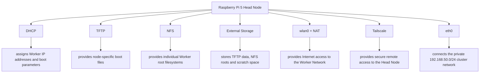

The architecture provides centralized administration while keeping the Worker Nodes within a private network.

The Worker operating systems are provided centrally through DHCP, TFTP, and NFS.

Remote users connect securely to the Head Node through Tailscale and can then administer the internal Worker Nodes from the central management system.

This avoids the need to expose individual Worker Nodes or the SSH service directly to the public Internet.
