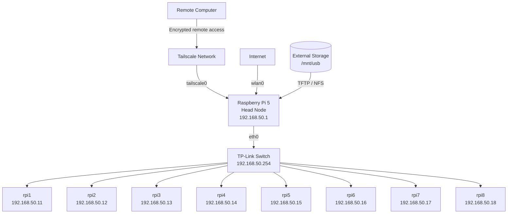

# Cluster Infrastructure and Remote Access

---

This documentation describes the infrastructure and remote administration architecture of the Raspberry Pi compute cluster.

The infrastructure provides:

* centralized network configuration,
* network-based booting of the worker nodes,
* individual NFS root filesystems,
* shared storage,
* Internet access through the head node,
* secure remote administration using Tailscale,
* and a dedicated Ethernet network for cluster and MPI communication.

The Raspberry Pi 5 acts as the central infrastructure and management node, while eight Raspberry Pi 3 Model B v1.2 systems act as compute workers.



---

## Table of Contents

* [1. Infrastructure Overview](#1-infrastructure-overview)
* [2. Network Boot and Storage](#2-network-boot-and-storage)
* [3. Network Access and Remote Administration](#3-network-access-and-remote-administration)
* [4. Verification and Troubleshooting](#4-verification-and-troubleshooting)

---

# 1. Infrastructure Overview

The cluster consists of one Raspberry Pi 5 head node and eight Raspberry Pi 3 Model B v1.2 worker nodes.

The head node provides the central services required by the worker systems.

| Component                       | Purpose                                                     |
| ------------------------------- | ----------------------------------------------------------- |
| Raspberry Pi 5                  | Head node, DHCP, TFTP, NFS, Internet gateway and management |
| 8 × Raspberry Pi 3 Model B v1.2 | Compute worker nodes                                        |
| TP-Link Switch                  | Internal Ethernet connectivity                              |
| External storage                | TFTP data, worker root filesystems and scratch storage      |
| MicroSD cards                   | Initial Raspberry Pi boot stage                             |
| Tailscale                       | Secure remote administration                                |
| `eth0`                          | Private cluster and MPI network                             |
| `wlan0`                         | Internet connectivity                                       |

The internal cluster network is:

```text
192.168.50.0/24
```

The head node is located at:

```text
192.168.50.1
```

The managed TP-Link switch uses:

```text
192.168.50.254
```

The worker nodes use the static addresses:

```text
192.168.50.11 - 192.168.50.18
```

STP PortFast was enabled on the switch edge ports connected to the Raspberry Pis.

This avoids unnecessary spanning-tree delays when a worker powers on and immediately starts its network boot process.

The main network interfaces on the head node have separate purposes:

| Interface         | Purpose                               |
| ----------------- | ------------------------------------- |
| `eth0`            | DHCP, TFTP, NFS, internal SSH and MPI |
| `wlan0`           | Internet access                       |
| `tailscale0`      | Secure remote administration          |
| Docker interfaces | Container networking                  |

The separation between these interfaces is important because MPI traffic must remain on the dedicated Ethernet cluster network.

---

# 2. Network Boot and Storage

The Raspberry Pi 3 workers use a network-based boot architecture.

Instead of maintaining an independent operating system installation on every worker MicroSD card, the head node provides the boot files and Linux root filesystems centrally.

The boot sequence is:

```text
Worker powers on
       |
       v
MicroSD loads bootcode.bin
       |
       v
Worker sends DHCP request
       |
       v
Head node assigns fixed IP address
       |
       v
Worker requests boot files via TFTP
       |
       v
Node-specific cmdline.txt is loaded
       |
       v
Linux mounts the worker-specific NFS root
       |
       v
Worker operating system starts
```

## Worker Boot Media

Each Raspberry Pi 3 worker contains a FAT32-formatted MicroSD card.

The card is only required for the initial Raspberry Pi firmware boot stage and contains:

```text
bootcode.bin
```

The Linux operating system itself is provided through the network.

This allows the worker environments to be managed centrally from the head node.

---

## Storage Architecture

The external storage device on the head node is mounted at:

```text
/mnt/usb
```

The documented block device is:

```text
/dev/sda1
```

with a capacity of approximately:

```text
29.8 GB
```

The storage contains:

* TFTP boot files,
* one NFS root filesystem per worker,
* shared scratch storage.

The directory layout is:

```text
/mnt/usb/
├── tftpboot/
├── scratch/
├── rpi1/
├── rpi2/
├── rpi3/
├── rpi4/
├── rpi5/
├── rpi6/
├── rpi7/
└── rpi8/
```

Each worker therefore receives an isolated root filesystem.

---

## Worker Assignment

The DHCP server identifies each worker by its Ethernet MAC address.

The Raspberry Pi boot process additionally uses a device-specific serial value to identify the corresponding TFTP directory.

| Hostname | IP Address      | MAC Address         | TFTP Directory |
| -------- | --------------- | ------------------- | -------------- |
| `rpi1`   | `192.168.50.11` | `b8:27:eb:84:e2:d1` | `4784e2d1`     |
| `rpi2`   | `192.168.50.12` | `b8:27:eb:bd:4a:b1` | `c5bd4ab1`     |
| `rpi3`   | `192.168.50.13` | `b8:27:eb:6f:54:ca` | `006f54ca`     |
| `rpi4`   | `192.168.50.14` | `b8:27:eb:bc:ec:67` | `86bcec67`     |
| `rpi5`   | `192.168.50.15` | `b8:27:eb:23:95:78` | `c8239578`     |
| `rpi6`   | `192.168.50.16` | `b8:27:eb:6c:70:7e` | `486c707e`     |
| `rpi7`   | `192.168.50.17` | `b8:27:eb:90:08:15` | `2e900815`     |
| `rpi8`   | `192.168.50.18` | `b8:27:eb:c5:22:2c` | `4dc5222c`     |

This creates a deterministic mapping between physical hardware, IP address, TFTP configuration and NFS root filesystem.

---

## DHCP Configuration

The head node runs an authoritative ISC DHCP server.

The configuration is stored in:

```text
/etc/dhcp/dhcpd.conf
```

The DHCP server:

* assigns fixed IP addresses,
* assigns worker hostnames,
* identifies workers using their MAC addresses,
* specifies the TFTP server,
* supplies the Raspberry Pi network-boot options.

The configuration is:

```text
ddns-update-style none;
authoritative;
log-facility local7;

option option-43 code 43 = text;
option option-66 code 66 = text;

subnet 10.3.31.0 netmask 255.255.255.0 {}

group {
    option broadcast-address 192.168.50.255;
    option routers 192.168.50.1;
    default-lease-time 600;
    max-lease-time 7200;
    option domain-name "cluster";
    option domain-name-servers 8.8.8.8, 8.8.4.4;

    subnet 192.168.50.0 netmask 255.255.255.0 {
        range 192.168.50.20 192.168.50.250;

        host cluster {
            hardware ethernet 88:a2:9e:b0:ba:e3;
            fixed-address 192.168.50.1;
        }

        host switch {
            hardware ethernet 8c:86:dd:44:82:bd;
            fixed-address 192.168.50.254;
        }

        host rpi1 {
            option root-path "/mnt/usb/tftpboot/";
            hardware ethernet b8:27:eb:84:e2:d1;
            option option-43 "Raspberry Pi Boot";
            option option-66 "192.168.50.1";
            next-server 192.168.50.1;
            fixed-address 192.168.50.11;
            option host-name "rpi1";
        }

        host rpi2 {
            option root-path "/mnt/usb/tftpboot/";
            hardware ethernet b8:27:eb:bd:4a:b1;
            option option-43 "Raspberry Pi Boot";
            option option-66 "192.168.50.1";
            next-server 192.168.50.1;
            fixed-address 192.168.50.12;
            option host-name "rpi2";
        }

        host rpi3 {
            option root-path "/mnt/usb/tftpboot/";
            hardware ethernet b8:27:eb:6f:54:ca;
            option option-43 "Raspberry Pi Boot";
            option option-66 "192.168.50.1";
            next-server 192.168.50.1;
            fixed-address 192.168.50.13;
            option host-name "rpi3";
        }

        host rpi4 {
            option root-path "/mnt/usb/tftpboot/";
            hardware ethernet b8:27:eb:bc:ec:67;
            option option-43 "Raspberry Pi Boot";
            option option-66 "192.168.50.1";
            next-server 192.168.50.1;
            fixed-address 192.168.50.14;
            option host-name "rpi4";
        }

        host rpi5 {
            option root-path "/mnt/usb/tftpboot/";
            hardware ethernet b8:27:eb:23:95:78;
            option option-43 "Raspberry Pi Boot";
            option option-66 "192.168.50.1";
            next-server 192.168.50.1;
            fixed-address 192.168.50.15;
            option host-name "rpi5";
        }

        host rpi6 {
            option root-path "/mnt/usb/tftpboot/";
            hardware ethernet b8:27:eb:6c:70:7e;
            option option-43 "Raspberry Pi Boot";
            option option-66 "192.168.50.1";
            next-server 192.168.50.1;
            fixed-address 192.168.50.16;
            option host-name "rpi6";
        }

        host rpi7 {
            option root-path "/mnt/usb/tftpboot/";
            hardware ethernet b8:27:eb:90:08:15;
            option option-43 "Raspberry Pi Boot";
            option option-66 "192.168.50.1";
            next-server 192.168.50.1;
            fixed-address 192.168.50.17;
            option host-name "rpi7";
        }

        host rpi8 {
            option root-path "/mnt/usb/tftpboot/";
            hardware ethernet b8:27:eb:c5:22:2c;
            option option-43 "Raspberry Pi Boot";
            option option-66 "192.168.50.1";
            next-server 192.168.50.1;
            fixed-address 192.168.50.18;
            option host-name "rpi8";
        }
    }
}
```

After modifying the DHCP configuration, restart the service:

```bash
sudo systemctl restart isc-dhcp-server
```

Verify the service:

```bash
sudo systemctl status isc-dhcp-server
```

---

## TFTP Boot

The TFTP root directory is:

```text
/mnt/usb/tftpboot/
```

The files must be readable by the Raspberry Pi boot firmware.

The documented permissions are:

```bash
sudo chmod -R 755 /mnt/usb/tftpboot/
```

Each worker retrieves boot files from a directory corresponding to its Raspberry Pi serial identifier:

```text
/mnt/usb/tftpboot/
├── 4784e2d1/   # rpi1
├── c5bd4ab1/   # rpi2
├── 006f54ca/   # rpi3
├── 86bcec67/   # rpi4
├── c8239578/   # rpi5
├── 486c707e/   # rpi6
├── 2e900815/   # rpi7
└── 4dc5222c/   # rpi8
```

Every worker-specific TFTP directory contains a corresponding:

```text
cmdline.txt
```

This file tells the Linux kernel which NFS root filesystem belongs to the worker.

Example for `rpi1`:

```text
console=serial0,115200 console=tty1 root=/dev/nfs nfsroot=192.168.50.1:/mnt/usb/rpi1,vers=3 rw ip=dhcp rootwait elevator=deadline
```

The relevant NFS handoff is:

```text
nfsroot=192.168.50.1:/mnt/usb/rpi1,vers=3
```

For the other nodes, the root path points to the corresponding worker directory.

---

## NFS Root Filesystems

The individual worker root filesystems are exported by the NFS kernel server.

The configuration is located at:

```text
/etc/exports
```

The exports are:

```text
/mnt/usb/scratch 192.168.50.0/24(rw,sync)

/mnt/usb/rpi1 192.168.50.0/24(rw,sync,no_subtree_check,no_root_squash)
/mnt/usb/rpi2 192.168.50.0/24(rw,sync,no_subtree_check,no_root_squash)
/mnt/usb/rpi3 192.168.50.0/24(rw,sync,no_subtree_check,no_root_squash)
/mnt/usb/rpi4 192.168.50.0/24(rw,sync,no_subtree_check,no_root_squash)
/mnt/usb/rpi5 192.168.50.0/24(rw,sync,no_subtree_check,no_root_squash)
/mnt/usb/rpi6 192.168.50.0/24(rw,sync,no_subtree_check,no_root_squash)
/mnt/usb/rpi7 192.168.50.0/24(rw,sync,no_subtree_check,no_root_squash)
/mnt/usb/rpi8 192.168.50.0/24(rw,sync,no_subtree_check,no_root_squash)
```

The option:

```text
no_root_squash
```

allows root operations inside the NFS-mounted worker root filesystem, which is required for system initialization.

Reload the NFS exports after changes:

```bash
sudo exportfs -ra
```

Verify the active exports:

```bash
sudo exportfs -v
```

---

# 3. Network Access and Remote Administration

The cluster separates three different networking purposes:

```text
eth0       -> internal cluster communication
wlan0      -> Internet connectivity
tailscale0 -> secure remote administration
```

This means that remote management does not require the private worker network to be directly exposed to the Internet.

---

## Internet Access for Worker Nodes

The worker nodes use the Raspberry Pi 5 as their Internet gateway.

NAT is configured on the head node.

Enable address translation:

```bash
sudo iptables -t nat -A POSTROUTING \
  -s 192.168.50.0/24 \
  -o wlan0 \
  -j MASQUERADE
```

Allow outgoing traffic:

```bash
sudo iptables -A FORWARD \
  -s 192.168.50.0/24 \
  -i eth0 \
  -o wlan0 \
  -j ACCEPT
```

Allow established response traffic:

```bash
sudo iptables -A FORWARD \
  -d 192.168.50.0/24 \
  -i wlan0 \
  -o eth0 \
  -m state \
  --state RELATED,ESTABLISHED \
  -j ACCEPT
```

Connectivity can be checked from a worker using:

```bash
ping -c 2 8.8.8.8
ping -c 2 deb.debian.org
sudo apt update
```

No direct inbound port forwarding to the workers is required.

---

## Tailscale Remote Access

Remote administration is performed through the Raspberry Pi 5 head node.

The goal is:

```text
Remote computer
       |
       | Internet
       v
Tailscale
       |
       | encrypted connection
       v
Head Node
       |
       | private cluster network
       v
Worker Nodes
```

Only the head node needs to be part of the Tailscale network.

The worker nodes remain exclusively inside:

```text
192.168.50.0/24
```

This avoids the need to install Tailscale on every worker.

Tailscale was selected because it provides encrypted connectivity without requiring:

* SSH port forwarding on the router,
* public exposure of TCP port 22,
* a static public IPv4 address,
* Dynamic DNS,
* a separately hosted public VPN server.

---

## Tailscale Installation

Before installing Tailscale, the local package information was updated:

```bash
sudo apt update
```

The required utilities were installed:

```bash
sudo apt install lsb-release curl -y
```

`curl` was required to retrieve repository data, while `lsb-release` provides information about the installed Linux distribution.

The official Tailscale APT repository from:

```text
pkgs.tailscale.com
```

was then added together with its repository signing key.

The signing key allows APT to verify that the downloaded packages originate from the expected repository.

After adding the repository, the package information was refreshed:

```bash
sudo apt update
```

Tailscale was installed using:

```bash
sudo apt install tailscale -y
```

---

## Connecting the Head Node

After installation, the head node was connected to the Tailscale network using:

```bash
sudo tailscale up
```

The command returns an authentication URL.

This URL is opened in a browser and the Raspberry Pi is authorized using the corresponding Tailscale account.

After successful authentication, the head node becomes part of the private Tailscale network.

Tailscale creates the virtual interface:

```text
tailscale0
```

A later documented cluster state showed:

```text
tailscale0 UNKNOWN 100.95.198.3/32
```

The Tailscale address is independent of the head node's internal cluster address:

```text
192.168.50.1
```

---

## Verifying Tailscale

The connection status can be checked using:

```bash
tailscale status
```

A normal entry has the form:

```text
100.x.x.x    raspberrypi    <account>    linux    -
```

Display only the IPv4 address:

```bash
tailscale ip -4
```

The virtual network interface can also be inspected using:

```bash
ip -br addr show tailscale0
```

---

## Windows Client and SSH

The remote Windows computer also runs Tailscale and is authenticated into the same Tailscale network.

The Windows PC and the head node do not need to be connected to the same physical network.

Once both systems are connected through Tailscale, standard OpenSSH is used for administration.

Tailscale only provides the encrypted network path.

From Windows PowerShell:

```powershell
ssh cloud-computing@<TAILSCALE-IP>
```

For example:

```powershell
ssh cloud-computing@100.x.x.x
```

During the first connection, OpenSSH displays the host-key verification prompt:

```text
The authenticity of host '<IP>' can't be established.
ED25519 key fingerprint is ...
Are you sure you want to continue connecting (yes/no/[fingerprint])?
```

After verifying the fingerprint, the host can be accepted using:

```text
yes
```

The key is then stored in the client's `known_hosts` file.

Future SSH connections can use this stored information to detect unexpected changes in the identity of the remote host.

---

## Accessing the Worker Nodes Remotely

Tailscale provides access to the head node.

The head node then acts as the administrative entry point to the internal cluster.

For example:

```text
Windows PC
    |
    | Tailscale + SSH
    v
Head Node
    |
    +--> ssh rpi1
    +--> ssh rpi2
    +--> ssh rpi3
    +--> ...
    +--> ssh rpi8
```

After logging into the head node, a worker can therefore be reached using:

```bash
ssh rpi1
```

or:

```bash
ssh pi@192.168.50.11
```

The same principle applies to internal cluster services such as:

* NFS,
* TFTP,
* container workloads,
* cluster administration tools.

There is no requirement to expose every worker node individually to the Internet.

---

## No Tailscale Subnet Router

Tailscale supports advertising an internal network such as:

```text
192.168.50.0/24
```

through a Tailscale Subnet Router.

This would allow remote clients to access worker IP addresses directly through Tailscale.

This functionality was not required for the implemented solution.

The desired access model is:

```text
Internet
   |
Tailscale
   |
Head Node
   |
Internal Worker Network
```

The head node therefore acts as the central administrative entry point.

---

## Security Concept

The SSH service is not intentionally exposed to the public Internet using router port forwarding.

The following architecture is avoided:

```text
Internet
   |
Public TCP/22
   |
Head Node
```

Instead:

```text
Internet
   |
Encrypted Tailscale connection
   |
Head Node
```

The advantages are:

* no public SSH port forwarding,
* no static public IP requirement,
* no Dynamic DNS requirement,
* encrypted remote communication,
* authorization through the private Tailscale network,
* worker nodes remain isolated.

---

## Separation from MPI Traffic

Tailscale is used for **administrative access only**.

MPI communication remains on:

```text
eth0
```

and the private network:

```text
192.168.50.0/24
```

This separation became especially important because the head node contains multiple network interfaces:

```text
lo
eth0
wlan0
tailscale0
docker_gwbridge
docker0
```

During MPI testing, OpenMPI initially attempted to communicate using a Docker address:

```text
172.17.0.1
```

which resulted in:

```text
connect() to 172.17.0.1:1025 failed
Error: Connection refused (111)
```

OpenMPI was therefore explicitly restricted to Ethernet using:

```bash
--mca btl_tcp_if_include eth0
--mca oob_tcp_if_include eth0
```

The permanent configuration is stored in:

```text
/home/cloud-computing/.openmpi/mca-params.conf
```

with:

```text
plm_rsh_no_tree_spawn = 1
btl_tcp_if_include = eth0
oob_tcp_if_include = eth0
```

The resulting traffic separation is:

| Traffic               | Interface    |
| --------------------- | ------------ |
| Remote administration | `tailscale0` |
| Internet access       | `wlan0`      |
| DHCP                  | `eth0`       |
| TFTP                  | `eth0`       |
| NFS                   | `eth0`       |
| Internal SSH          | `eth0`       |
| MPI                   | `eth0`       |

---

# 4. Verification and Troubleshooting

The infrastructure can be verified from the Raspberry Pi 5 head node.

## Storage

Check that the external storage is mounted:

```bash
df -h /mnt/usb
```

Inspect the directory structure:

```bash
ls -lah /mnt/usb
```

Display storage consumption:

```bash
sudo du -xh --max-depth=1 /mnt/usb | sort -h
```

---

## DHCP

Check the DHCP server:

```bash
sudo systemctl status isc-dhcp-server
```

Restart it if required:

```bash
sudo systemctl restart isc-dhcp-server
```

Inspect the configuration:

```bash
sudo cat /etc/dhcp/dhcpd.conf
```

---

## TFTP

Check the TFTP server:

```bash
sudo systemctl status tftpd-hpa
```

Inspect the TFTP tree:

```bash
ls -lah /mnt/usb/tftpboot/
```

Check permissions:

```bash
ls -ld /mnt/usb/tftpboot
```

---

## NFS

Check the NFS server:

```bash
sudo systemctl status nfs-kernel-server
```

Display active exports:

```bash
sudo exportfs -v
```

Reload them if necessary:

```bash
sudo exportfs -ra
```

---

## Monitoring the Network Boot

DHCP and TFTP traffic can be monitored directly:

```bash
sudo tcpdump \
  -i eth0 \
  -n \
  port 67 or port 68 or port 69
```

A normal boot should follow this sequence:

```text
1. Worker sends DHCP request
2. Head node responds with network configuration
3. Worker requests files through TFTP
4. Linux kernel starts
5. Worker mounts its NFS root filesystem
6. Worker becomes reachable through the cluster network
```

After booting, test a worker using:

```bash
ping 192.168.50.11
```

and:

```bash
ssh rpi1 hostname
```

---

## Tailscale

Check the Tailscale connection:

```bash
tailscale status
```

Display the current IPv4 address:

```bash
tailscale ip -4
```

Inspect the network interface:

```bash
ip -br addr show tailscale0
```

From the remote Windows system:

```powershell
ssh cloud-computing@<TAILSCALE-IP>
```

---

## SSH Troubleshooting

During the initial Tailscale setup, the Tailscale connection itself worked and TCP port 22 on the Raspberry Pi was reachable, but an SSH test was initially closed by the SSH server.

The initial message was:

```text
Connection closed by <TAILSCALE-IP> port 22
```

At this stage, Tailscale connectivity was already working. The remaining problem was therefore located at the SSH service or SSH configuration level.

Check the SSH service:

```bash
sudo systemctl status ssh
```

Inspect SSH logs:

```bash
sudo journalctl -u ssh
```

This distinction is useful during troubleshooting:

```text
Tailscale IP unreachable
        -> Tailscale / Internet problem

Tailscale IP reachable but TCP/22 unavailable
        -> SSH service / firewall problem

SSH server responds but closes login
        -> SSH authentication or configuration problem
```

---

## Worker Connectivity

All worker nodes can be checked from the head node using:

```bash
for NODE in rpi1 rpi2 rpi3 rpi4 rpi5 rpi6 rpi7 rpi8
do
    ssh $NODE hostname
done
```

A successful result verifies that:

* the worker completed its network boot,
* DHCP configuration succeeded,
* the correct root filesystem is available,
* internal networking is operational,
* SSH is available.

---

## Infrastructure Summary

The complete infrastructure can be summarized as:

```text
Raspberry Pi 5 Head Node
│
├── DHCP
│   └── assigns worker addresses and network boot information
│
├── TFTP
│   └── provides node-specific boot files
│
├── NFS
│   └── provides individual worker root filesystems
│
├── External Storage
│   └── stores TFTP data, NFS roots and scratch data
│
├── wlan0 + NAT
│   └── provides Internet access to the worker network
│
├── Tailscale
│   └── provides secure remote access to the head node
│
└── eth0
    └── provides DHCP, TFTP, NFS, worker SSH and MPI communication
```

The resulting architecture allows the Raspberry Pi workers to be provisioned centrally while keeping the internal compute network isolated.

Remote users access only the head node through an encrypted Tailscale connection.

The head node then provides the administrative entry point into the private worker network, while MPI communication remains exclusively on the dedicated Ethernet infrastructure.
