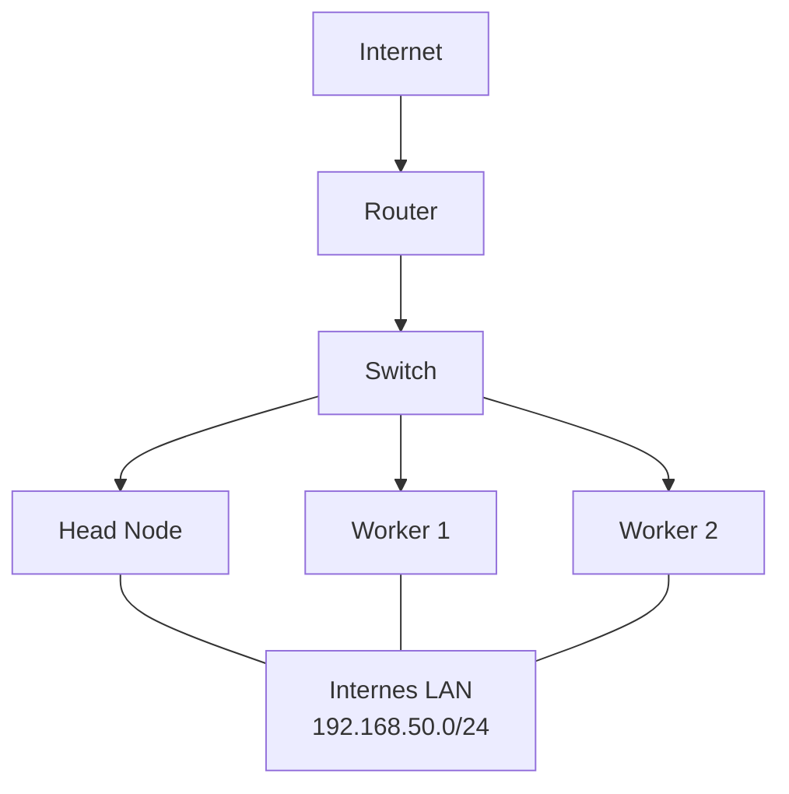
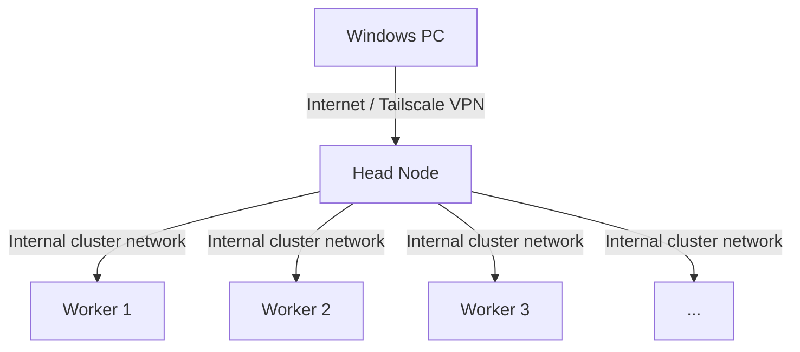
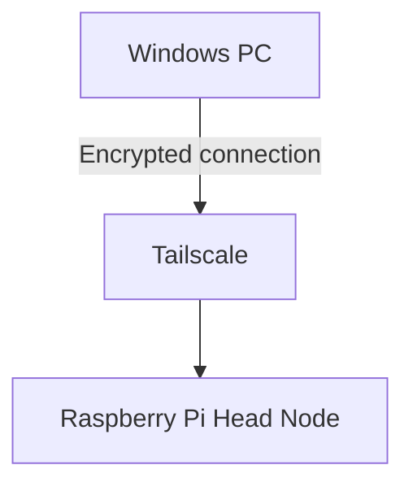
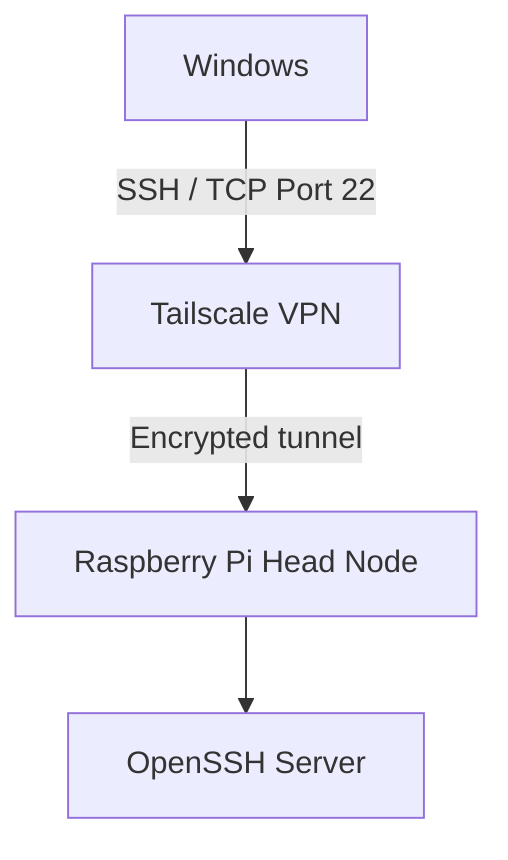
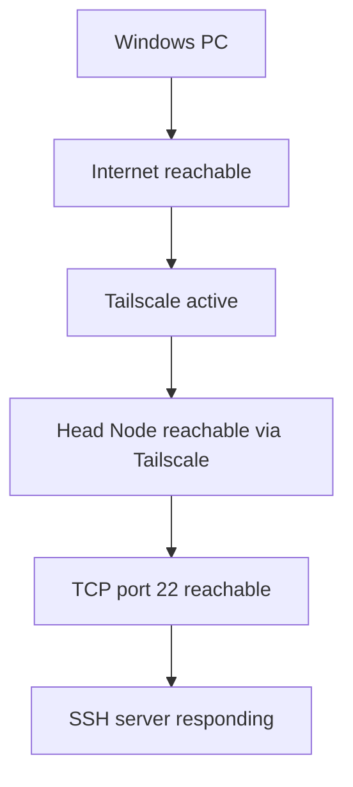
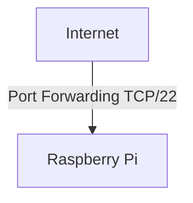
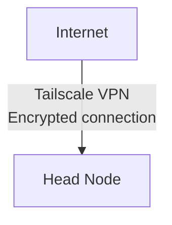
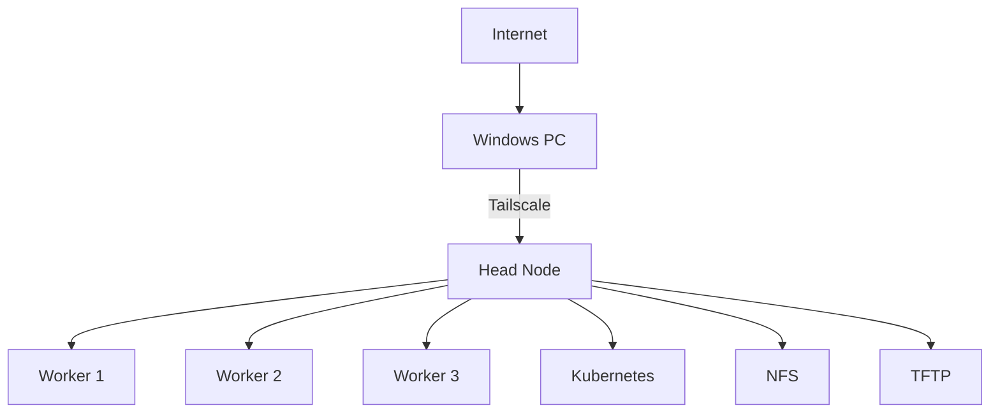
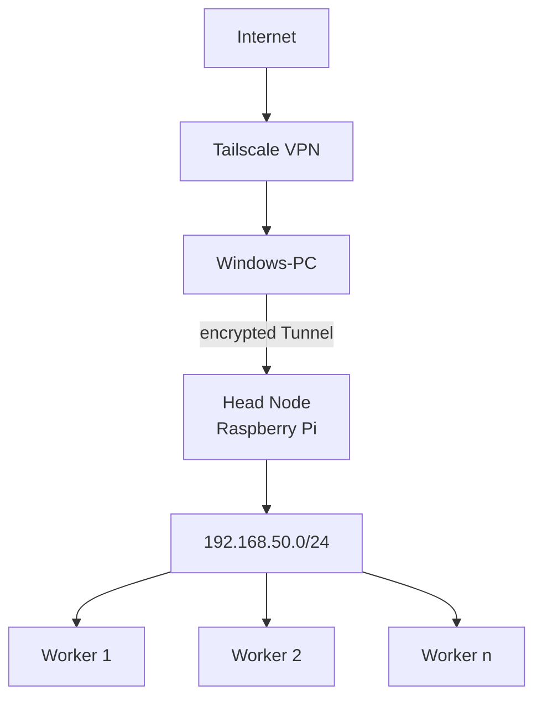

# Remote Access to the Raspberry Pi Cluster via Tailscale

---

# Table of Contents
1. [Objective](#1-objective)
2. [Existing Network Architecture](#2-existing-network-architecture)
3. [Remote Access Concept](#3-remote-access-concept)
4. [Advantages of This Solution](#4-advantages-of-this-solution)
5. [Preparing the Head Node](#5-preparing-the-head-node)
6. [Installing Tailscale](#6-installing-tailscale)
7. [Connecting the Head Node to Tailscale](#7-connecting-the-head-node-to-tailscale)
8. [Verifying the Tailscale Connection](#8-verifying-the-tailscale-connection)
9. [Tailscale on the Windows Client](#9-tailscale-on-the-windows-client)
10. [SSH Access via Tailscale](#10-ssh-access-via-tailscale)
11. [First SSH Connection](#11-first-ssh-connection)
12. [Current SSH Connection Status](#12-current-ssh-connection-status)
13. [Security Concept](#13-security-concept)
14. [Access to the Rest of the Cluster](#14-access-to-the-rest-of-the-cluster)
15. [No Subnet Router Configuration Required](#15-no-subnet-router-configuration-required)
16. [Summary](#16-summary)
17. [Status](#status)

---

## 1. Objective

The goal of this configuration is to make the **Head Node of the Raspberry Pi cluster securely accessible over the Internet**.

The Worker Nodes remain exclusively within the internal cluster network. External access is only provided to the Head Node.

The Head Node can therefore be used as the central entry point for remote administration of the entire cluster.

This is particularly important because all group members need to be able to work on their tasks remotely. Initially, the cluster had to be physically assembled and disassembled whenever it was used. Due to planned automation and the requirement for remote access, Tailscale was introduced.

Examples of tasks that can be performed through the Head Node:

- SSH access to the Head Node
- Administration of the Worker Nodes
- Administration of Kubernetes/k3s
- Management of Docker containers
- Access to internal cluster services

---

## 2. Existing Network Architecture

The Raspberry Pi cluster already operates within an internal network.



The Head Node already provides several central services within the cluster:

- DHCP
- TFTP
- NFS
- PXE boot for the Worker Nodes

The Worker Nodes are located within the internal network:

```text
192.168.50.0/24
```

The existing cluster network was not modified for remote access.

---

## 3. Remote Access Concept

**Tailscale** is used to provide secure access to the Head Node over the Internet.

Tailscale creates an encrypted overlay network between authorized devices. The communication is based on WireGuard.

The architecture is therefore extended as follows:



Only the Head Node is added to the Tailscale network.

The Worker Nodes do not require their own Tailscale installation.

---

## 4. Advantages of This Solution

Using Tailscale eliminates the need for direct port forwarding on the router.

In particular, the following is **not required**:

- SSH port forwarding
- Public exposure of TCP port 22
- Static public IPv4 address
- Dynamic DNS
- A separately hosted public VPN server
- Direct Internet access to the Worker Nodes

Access is restricted to devices that have been authorized within the private Tailscale network.

---

## 5. Preparing the Head Node

First, the local package information was updated:

```bash
sudo apt update
```

This command does not install system updates. It only updates the local information about available packages and their versions.

The required utilities were then installed:

```bash
sudo apt install lsb-release curl -y
```

### Packages Used

#### `curl`

`curl` is used to download data and files via HTTP or HTTPS.

#### `lsb-release`

`lsb-release` provides information about the installed Linux distribution.

#### `-y`

The `-y` option automatically confirms the package installation.

---

## 6. Installing Tailscale

Tailscale was installed using the official Tailscale APT repository.

First, the package source from:

```text
pkgs.tailscale.com
```

was added to the system.

The repository signing key was also installed. This allows APT to verify that downloaded Tailscale packages originate from the expected source and have not been modified.

After adding the repository, the package information was updated again:

```bash
sudo apt update
```

Tailscale was then installed:

```bash
sudo apt install tailscale -y
```

---

## 7. Connecting the Head Node to Tailscale

After the installation was completed, Tailscale was activated using:

```bash
sudo tailscale up
```

The command generates an authentication URL.

This URL is opened in a web browser, where the Raspberry Pi is authorized using a Tailscale account.

After successful authentication, the Head Node becomes part of the private Tailscale network.

---

## 8. Verifying the Tailscale Connection

The current Tailscale status can be checked on the Raspberry Pi using:

```bash
tailscale status
```

A successful output looks similar to:

```text
100.x.x.x    raspberrypi    <account>    linux    -
```

The address:

```text
100.x.x.x
```

is the virtual Tailscale IP address assigned to the Head Node.

The IPv4 address can also be displayed directly using:

```bash
tailscale ip -4
```

---

## 9. Tailscale on the Windows Client

To access the Head Node from a Windows PC, Tailscale must also be installed on the Windows system.

The Windows PC is then connected to the same Tailscale network.

After authentication, the Windows PC and the Raspberry Pi are logically located within the same private overlay network.



The devices do not need to be connected to the same physical network.

For example, the Windows PC can use another Internet connection, a different Wi-Fi network, or a mobile network while still being able to reach the Head Node.

---

## 10. SSH Access via Tailscale

Standard OpenSSH is used to administer the Head Node.

Tailscale only provides the secure network connection between the Windows client and the Raspberry Pi.

The connection works as follows:



On Windows, the SSH connection can be initiated from PowerShell:

```powershell
ssh cloud-computing@<TAILSCALE-IP>
```

Example:

```powershell
ssh cloud-computing@100.x.x.x
```

In this case:

```text
cloud-computing
```

is the username on the Raspberry Pi.

---

## 11. First SSH Connection

During the first SSH connection, OpenSSH displays a security message similar to:

```text
The authenticity of host '<IP>' can't be established.
ED25519 key fingerprint is ...
Are you sure you want to continue connecting (yes/no/[fingerprint])?
```

This message is normal during the first connection.

At this point, SSH does not yet know the host key of the Raspberry Pi.

After verifying the fingerprint, the connection can be accepted by entering:

```text
yes
```

The SSH host key is then stored in the `known_hosts` file on the Windows computer.

For future connections, SSH can use this information to detect unexpected changes to the identity of the remote server.

---

## 12. Current SSH Connection Status

The network connection to the Raspberry Pi via Tailscale was successfully established.

During the SSH test, the SSH server on the Raspberry Pi was reached successfully and its host key was stored on the Windows client.

However, the SSH server subsequently closed the connection:

```text
Connection closed by <TAILSCALE-IP> port 22
```

This confirms that the following components are already working:



The remaining troubleshooting therefore concerns the SSH configuration or SSH service on the Raspberry Pi rather than the Tailscale network connection itself.

The SSH service can first be checked on the Head Node using:

```bash
sudo systemctl status ssh
```

The SSH logs can additionally be inspected using:

```bash
sudo journalctl -u ssh
```

---

## 13. Security Concept

An important advantage of this architecture is that the SSH port of the Head Node does not need to be exposed directly to the public Internet.

The following architecture is **not** used:



Instead, the following architecture is used:



The Raspberry Pi therefore remains behind the existing router and NAT configuration.

The Worker Nodes remain completely within the private cluster network.

---

## 14. Access to the Rest of the Cluster

For the current task, only the Head Node is made externally accessible.

After successfully connecting to the Head Node, internal systems can be administered from there.

Example:



It is therefore not necessary to make every Worker Node individually accessible over the Internet.

Kubernetes also does not need to be exposed directly to the public Internet for basic administration, as long as cluster administration is performed through the Head Node.

---

## 15. No Subnet Router Configuration Required

Tailscale also supports forwarding complete internal networks through a so-called **Subnet Router**.

For example, the Head Node could advertise the network:

```text
192.168.50.0/24
```

through Tailscale.

This would allow authorized Tailscale clients to directly access devices within the cluster subnet.

However, this functionality is not required for the current task.

The current goal is only to provide:

```text
Internet -> Tailscale -> Head Node
```

The Worker Nodes remain behind the Head Node and within the existing internal cluster network.

---

## 16. Summary

A secure remote access solution using Tailscale was configured for the Raspberry Pi cluster.

The existing cluster infrastructure did not need to be modified.

In addition to its local network address, the Head Node now has a virtual Tailscale IP address. This allows authorized Tailscale devices to reach the Head Node over the Internet.

The resulting architecture is:



The following requirements are therefore fulfilled:

- Head Node is reachable over the Internet
- Communication is encrypted
- No public SSH port exposure is required
- No Dynamic DNS is required
- No static public IPv4 address is required
- No changes to the existing PXE/NFS cluster network are required
- Worker Nodes remain separated from the public Internet
- Central cluster administration is possible through the Head Node

---

## Status

**Tailscale connection: successfully configured**

**Head Node reachable through Tailscale: successful**

**SSH port on the Head Node reachable: successful**

**SSH login: further configuration/troubleshooting required**
