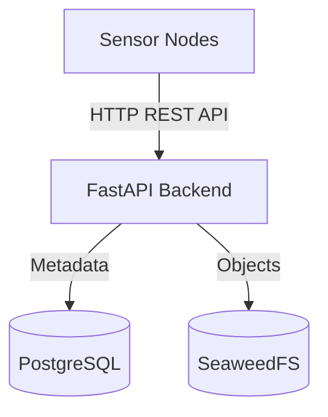

# Backend

---

This manual provides a guide for setting up and deploying the backend.<br> 
It consists of the following components:

| Component    | Purpose                                             |
|--------------|-----------------------------------------------------|
| FastAPI      | Provides the REST API and processes incoming events |
| PostgreSQL   | Stores event and node metadata                      |
| SeaweedFS    | Stores event images via S3-compatible API           |

The Sensor Nodes send their detection events to the FastAPI backend via HTTP.<br>
The backend stores metadata in PostgreSQL and the associated images in SeaweedFS.



---

## Table of Contents
- [Local Development](#local-development)
- [Docker Swarm Deployment](#docker-swarm-deployment)
- [References](#references)

---

# Local Development

The following requirements need to be met:

- Docker and Docker Compose installed
- Git installed

---

Start all services in detached mode

```bash
docker compose up -d
```

Check the running containers

```bash
docker compose ps
```

The FastAPI Swagger interface is available at

```text
http://localhost:8000/docs
```

The SeaweedFS user interface is available at

```text
http://localhost:8888
```

Stop the Services

```bash
docker compose down
```

---

# Docker Swarm Deployment

The following requirements need to be met:

1. Manager Node
   - Docker Engine installed
   - Docker Swarm initialized as the manager
   - SSH access to all worker nodes

2. Worker Nodes
   - Docker Engine installed
   - Joined to the Swarm as workers
   - All nodes in `Ready` state

---

The following ports must be allowed on all Swarm nodes so that they can communicate with each other.

| Port | Protocol | Purpose                 |
| ---- | -------- | ----------------------- |
| 2377 | TCP      | Swarm control plane     |
| 7946 | TCP/UDP  | Node discovery          |
| 4789 | UDP      | Overlay network (VXLAN) |

Allow these ports on all Swarm nodes

```bash
sudo ufw allow from <swarm-subnet> to any port 2377 proto tcp && sudo ufw allow from <swarm-subnet> to any port 7946 proto tcp && sudo ufw allow from <swarm-subnet> to any port 7946 proto udp && sudo ufw allow from <swarm-subnet> to any port 4789 proto udp && sudo ufw reload
```

Verify the firewall configuration with

```bash
sudo ufw status
```

---

Run the following command on the manager node

```bash
docker swarm init --advertise-addr <manager-ip>
```

The output contains a join token for worker nodes

```text
docker swarm join --token SWMTKN-1-... <manager-ip>:2377
```

Run the join command on each worker node.<br> 
Verify that all nodes are registered on the manager afterward.

```bash
docker node ls
```

---

Build and distribute the Backend Image

```bash
docker build -t cloud-backend:latest .
```

Verify the image was created

```bash
docker images
```

Distribute the Image to Worker Nodes

```bash
docker save cloud-backend:latest | ssh pi@rpi1 docker load

# Transfer to all workers at once

for HOST in rpi1 rpi2 rpi3
do
    docker save cloud-backend:latest | ssh pi@$HOST docker load
done
```

Verify the image on a worker node

```bash
ssh pi@rpi1 docker images
```

---

Deploy the Stack from the Manager Node

```bash
docker stack deploy -c docker-stack.yml cloud
```

Check that all services are running

```bash
docker service ls
```

Verify that backend replicas have been scheduled successfully

```bash
docker service ps cloud_backend
```

This shows the state of each backend replica and on which Swarm node it is running

The FastAPI Swagger interface is available at

```text
http://<node-ip>:8000/docs
```

The SeaweedFS user interface is available at

```text
http://<node-ip>:8888
```

---

# References

- Docker Documentation: https://docs.docker.com/
- Docker Swarm Documentation: https://docs.docker.com/engine/swarm/
- FastAPI Documentation: https://fastapi.tiangolo.com/
- PostgreSQL Documentation: https://www.postgresql.org/docs/
- SeaweedFS Documentation: https://github.com/seaweedfs/seaweedfs
