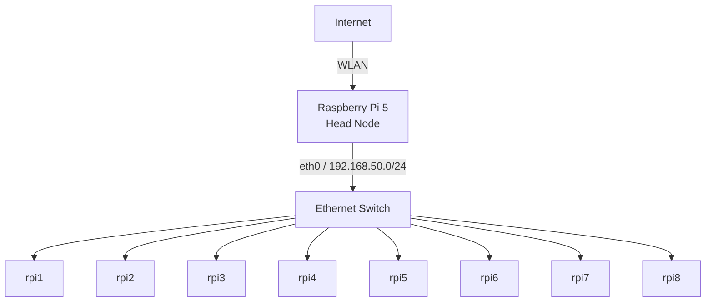

# Raspberry Pi MPI Cluster Performance

---

This documentation describes the setup, configuration, benchmarking, and scalability analysis of the Raspberry Pi Edge Computing Cluster.

The goal of the cluster is to execute distributed workloads using MPI and to evaluate the performance and scalability of a small ARM-based computing cluster.

The project covers:

* setup of a private Raspberry Pi compute cluster,
* passwordless SSH communication,
* distributed execution using OpenMPI,
* automated benchmark collection,
* Monte Carlo π as a highly parallel MPI workload,
* distributed matrix multiplication as a communication-intensive workload,
* High Performance LINPACK (HPL),
* GFLOPS measurements,
* strong scaling according to Amdahl's Law,
* scaled workload experiments according to Gustafson's Law,
* analysis of communication, memory, and hardware bottlenecks.

The main components are:

| Component             | Purpose                                           |
| --------------------- | ------------------------------------------------- |
| Raspberry Pi 5        | Head node and cluster management                  |
| Raspberry Pi 3        | MPI worker nodes                                  |
| OpenMPI               | Distributed process execution                     |
| Monte Carlo π         | Low-communication MPI benchmark                   |
| Matrix Multiplication | Communication- and memory-intensive MPI benchmark |
| HPL                   | Floating-point performance measurement in GFLOPS  |



---

## Table of Contents

* [1. Cluster Overview and Architecture](#1-cluster-overview-and-architecture)
* [2. Cluster and MPI Configuration](#2-cluster-and-mpi-configuration)
* [3. MPI Benchmark Applications](#3-mpi-benchmark-applications)
* [4. Automated Benchmarking and HPL](#4-automated-benchmarking-and-hpl)
* [5. Experimental Methodology and Scalability](#5-experimental-methodology-and-scalability)
* [6. Results and Bottleneck Analysis](#6-results-and-bottleneck-analysis)
* [7. Conclusion](#7-conclusion)
* [References](#references)

---

# 1. Cluster Overview and Architecture

## 1.1 Hardware and Operating System

The cluster consists of one head node and eight worker nodes.

| Property           | Configuration      |
| ------------------ | ------------------ |
| Head Node          | Raspberry Pi 5     |
| Worker Nodes       | Raspberry Pi 3     |
| Operating System   | Debian 13 (Trixie) |
| Architecture       | ARM64 / aarch64    |
| Internal Network   | `192.168.50.0/24`  |
| Cluster Interface  | `eth0`             |
| Internet Interface | `wlan0`            |
| Worker User        | `pi`               |

The worker nodes are addressed by the following hostnames:

```text
rpi1
rpi2
rpi3
rpi4
rpi5
rpi6
rpi7
rpi8
```

The head node is responsible for:

* managing the worker nodes,
* starting distributed MPI jobs,
* compiling benchmark applications,
* collecting benchmark results,
* providing Internet access to the private worker network.

For the final scalability measurements, the Raspberry Pi 3 worker nodes were used as the compute nodes. This avoids directly comparing the significantly faster Raspberry Pi 5 head node with the Raspberry Pi 3 workers during the scaling experiments.

---

## 1.2 Network Architecture

The private cluster network is:

```text
192.168.50.0/24
```

The physical Ethernet interface used for communication between the Raspberry Pis is:

```text
eth0
```

The head node also contains additional interfaces, including:

```text
wlan0
tailscale0
docker0
docker_gwbridge
```

The existence of multiple network interfaces later became relevant for OpenMPI because MPI initially attempted to use a Docker network instead of the physical cluster network.

The MPI configuration was therefore explicitly restricted to `eth0`.

---

## 1.3 Internet Access for Worker Nodes

The worker nodes are located inside the private cluster network and use the head node as their gateway for Internet access.

NAT was configured on the head node.

Enable address translation:

```bash
sudo iptables -t nat -A POSTROUTING \
  -s 192.168.50.0/24 \
  -o wlan0 \
  -j MASQUERADE
```

Allow outgoing traffic from the cluster network:

```bash
sudo iptables -A FORWARD \
  -s 192.168.50.0/24 \
  -i eth0 \
  -o wlan0 \
  -j ACCEPT
```

Allow response traffic back to the worker network:

```bash
sudo iptables -A FORWARD \
  -d 192.168.50.0/24 \
  -i wlan0 \
  -o eth0 \
  -m state \
  --state RELATED,ESTABLISHED \
  -j ACCEPT
```

No inbound port forwarding to the workers was configured. The worker nodes therefore remain inside the private cluster network.

Internet connectivity can be verified from a worker using:

```bash
ping -c 2 8.8.8.8
ping -c 2 deb.debian.org
sudo apt update
```

---

# 2. Cluster and MPI Configuration

## 2.1 SSH Configuration

OpenMPI starts processes on remote nodes through SSH.

Passwordless SSH authentication was therefore configured between the head node and all worker nodes.

Generate an SSH key on the head node:

```bash
ssh-keygen -t ed25519
```

Copy the public key to all workers:

```bash
ssh-copy-id pi@rpi1
ssh-copy-id pi@rpi2
ssh-copy-id pi@rpi3
ssh-copy-id pi@rpi4
ssh-copy-id pi@rpi5
ssh-copy-id pi@rpi6
ssh-copy-id pi@rpi7
ssh-copy-id pi@rpi8
```

The SSH configuration is stored in:

```text
~/.ssh/config
```

Example configuration:

```text
Host rpi1 rpi2 rpi3 rpi4 rpi5 rpi6 rpi7 rpi8
    User pi
    IdentityFile ~/.ssh/id_ed25519
```

Set the required permissions:

```bash
chmod 600 ~/.ssh/config
```

Verify SSH connectivity:

```bash
for NODE in rpi1 rpi2 rpi3 rpi4 rpi5 rpi6 rpi7 rpi8
do
    ssh pi@$NODE hostname
done
```

Every worker should return its hostname without requesting a password.

This is required because MPI must be able to start processes automatically without interactive user input.

---

## 2.2 OpenMPI Installation

OpenMPI was installed on the head node:

```bash
sudo apt update
sudo apt install -y openmpi-bin libopenmpi-dev
```

The same packages were installed on all worker nodes:

```bash
for NODE in rpi1 rpi2 rpi3 rpi4 rpi5 rpi6 rpi7 rpi8
do
    ssh -t pi@$NODE \
      "sudo apt install -y openmpi-bin libopenmpi-dev"
done
```

Verify the local installation:

```bash
mpirun --version
mpicc --version
```

Verify OpenMPI on all worker nodes:

```bash
for NODE in rpi1 rpi2 rpi3 rpi4 rpi5 rpi6 rpi7 rpi8
do
    ssh pi@$NODE "mpirun --version | head -n 1"
done
```

The documented cluster installation used Open MPI 5.0.7.

---

## 2.3 MPI Hostfile

The hostfile specifies the compute nodes that can participate in MPI jobs.

The hostfile used by the benchmark scripts is:

```text
/home/cloud-computing/hosts
```

Its structure is:

```text
rpi1 slots=1
rpi2 slots=1
rpi3 slots=1
rpi4 slots=1
rpi5 slots=1
rpi6 slots=1
rpi7 slots=1
rpi8 slots=1
```

Each worker is assigned one MPI slot.

Verify that MPI can reach all worker nodes:

```bash
mpirun \
  --hostfile /home/cloud-computing/hosts \
  -np 8 \
  hostname
```

A successful execution returns the hostnames of the participating worker nodes.

---

## 2.4 MPI Verification

A small MPI test program was created before running the actual benchmarks.

File:

```text
hello_mpi.c
```

Source code:

```c
#include <mpi.h>
#include <stdio.h>

int main(int argc, char** argv)
{
    MPI_Init(&argc, &argv);

    int rank;
    int size;

    MPI_Comm_rank(MPI_COMM_WORLD, &rank);
    MPI_Comm_size(MPI_COMM_WORLD, &size);

    char processor_name[MPI_MAX_PROCESSOR_NAME];
    int name_len;

    MPI_Get_processor_name(processor_name, &name_len);

    printf(
        "Hello from rank %d out of %d running on %s\n",
        rank,
        size,
        processor_name
    );

    MPI_Finalize();

    return 0;
}
```

Compile the program:

```bash
mpicc hello_mpi.c -o hello_mpi
```

Copy the executable to the worker nodes:

```bash
for NODE in rpi1 rpi2 rpi3 rpi4 rpi5 rpi6 rpi7 rpi8
do
    scp hello_mpi $NODE:/home/pi/
done
```

Execute it across the cluster:

```bash
mpirun \
  --hostfile /home/cloud-computing/hosts \
  -np 8 \
  /home/pi/hello_mpi
```

Each rank reports the physical Raspberry Pi on which it is running.

This test verifies:

* SSH communication,
* OpenMPI installation,
* remote process startup,
* MPI rank distribution,
* communication across physical cluster nodes.

---

## 2.5 Locale Configuration

Remote MPI processes initially produced locale warnings such as:

```text
bash: warning: setlocale:
LC_ALL: cannot change locale (en_US.UTF-8)
```

The available locales were checked using:

```bash
locale
locale -a
```

If required, `en_US.UTF-8` was enabled:

```bash
sudo sed -i \
  's/^# *en_US.UTF-8 UTF-8/en_US.UTF-8 UTF-8/' \
  /etc/locale.gen
```

Generate the locale:

```bash
sudo locale-gen
```

Set the default language:

```bash
sudo env -u LC_ALL \
  update-locale LANG=en_US.UTF-8
```

`LC_ALL` was intentionally not configured permanently because it overrides all other locale settings.

The automated benchmark scripts therefore use:

```bash
export LANG=en_US.UTF-8
unset LC_ALL
```

---

## 2.6 OpenMPI SSH Warning

During MPI startup the following warning occurred:

```text
plm:ssh: Warning:
setpgid(...) failed in parent
with errno=Permission denied(13)
```

The MPI applications still executed correctly, but the warning interfered with clean benchmark logs.

The following OpenMPI MCA option was used:

```bash
--mca plm_rsh_no_tree_spawn 1
```

The setting was later stored permanently together with the network configuration.

---

## 2.7 OpenMPI Network Interface Problem

After a restart of the cluster, a basic host test still succeeded:

```bash
mpirun \
  --hostfile /home/cloud-computing/hosts \
  -np 8 \
  hostname
```

However, actual MPI applications failed with errors such as:

```text
WARNING: Open MPI failed to TCP connect to a peer MPI process.

connect() to 172.17.0.1:1025 failed
Error: Connection refused (111)
```

The available network interfaces were inspected using:

```bash
ip -br addr
```

The system contained several interfaces:

```text
lo
eth0
wlan0
tailscale0
docker_gwbridge
docker0
veth...
```

The address:

```text
172.17.0.1
```

belongs to the Docker network.

The actual cluster communication network is:

```text
eth0
192.168.50.0/24
```

OpenMPI was therefore explicitly restricted to the physical Ethernet interface.

Test command:

```bash
mpirun \
  --mca plm_rsh_no_tree_spawn 1 \
  --mca btl_tcp_if_include eth0 \
  --mca oob_tcp_if_include eth0 \
  --hostfile /home/cloud-computing/hosts \
  -np 8 \
  /home/pi/montecarlo_pi \
  10000 \
  "test"
```

After successful verification, the settings were stored permanently.

Create the configuration directory:

```bash
mkdir -p ~/.openmpi
```

Configuration file:

```text
/home/cloud-computing/.openmpi/mca-params.conf
```

Content:

```text
plm_rsh_no_tree_spawn = 1
btl_tcp_if_include = eth0
oob_tcp_if_include = eth0
```

This prevents OpenMPI from selecting Docker, WLAN, or Tailscale interfaces for communication between cluster nodes.

---

# 3. MPI Benchmark Applications

Two MPI applications with different communication characteristics were selected.

| Property                 | Monte Carlo π           | Matrix Multiplication            |
| ------------------------ | ----------------------- | -------------------------------- |
| Independent calculations | Very high               | Lower                            |
| Communication overhead   | Very low                | Higher                           |
| Network dependency       | Low                     | Higher                           |
| Memory dependency        | Low                     | High                             |
| Expected scalability     | Close to linear         | More limited                     |
| Purpose                  | Ideal parallel workload | Communication-intensive workload |

Using two applications makes it possible to demonstrate that cluster scalability depends not only on the number of processors but also on the characteristics of the algorithm.

---

## 3.1 Monte Carlo π

The first MPI application estimates π using the Monte Carlo method.

Random points are generated in a square. A point lies inside the unit circle if:

```text
x² + y² <= 1
```

The approximation is then calculated using:

```text
π ≈ 4 × points_inside / total_points
```

The evaluation of individual random points is independent.

The total number of points can therefore be distributed almost perfectly across the MPI processes.

Only the final number of points inside the circle has to be combined using:

```text
MPI_Reduce
```

This makes Monte Carlo an almost embarrassingly parallel application.

The program was modified to support automated benchmarking.

Source:

```c
#include <mpi.h>
#include <stdio.h>
#include <stdlib.h>
#include <time.h>

int main(int argc, char** argv)
{
    MPI_Init(&argc, &argv);

    int rank;
    int size;

    long long total_points = 100000000;
    long long local_points;
    long long remainder;

    long long local_inside = 0;
    long long global_inside = 0;

    const char* timestamp = "unknown";

    MPI_Comm_rank(MPI_COMM_WORLD, &rank);
    MPI_Comm_size(MPI_COMM_WORLD, &size);

    if (argc > 1)
    {
        total_points = atoll(argv[1]);
    }

    if (argc > 2)
    {
        timestamp = argv[2];
    }

    local_points = total_points / size;
    remainder = total_points % size;

    if (rank < remainder)
    {
        local_points++;
    }

    unsigned int seed =
        time(NULL) + rank * 1337;

    double start = MPI_Wtime();

    for (long long i = 0; i < local_points; i++)
    {
        double x =
            (double)rand_r(&seed) / RAND_MAX;

        double y =
            (double)rand_r(&seed) / RAND_MAX;

        if (x * x + y * y <= 1.0)
        {
            local_inside++;
        }
    }

    MPI_Reduce(
        &local_inside,
        &global_inside,
        1,
        MPI_LONG_LONG,
        MPI_SUM,
        0,
        MPI_COMM_WORLD
    );

    double end = MPI_Wtime();

    if (rank == 0)
    {
        double pi =
            4.0 * global_inside / total_points;

        double runtime = end - start;

        printf(
            "%d,%lld,%.10f,%.6f,%s\n",
            size,
            total_points,
            pi,
            runtime,
            timestamp
        );
    }

    MPI_Finalize();

    return 0;
}
```

Compile:

```bash
mpicc montecarlo.c \
  -o /home/pi/montecarlo_pi
```

Example execution:

```bash
mpirun \
  --mca plm_rsh_no_tree_spawn 1 \
  --mca btl_tcp_if_include eth0 \
  --mca oob_tcp_if_include eth0 \
  --hostfile /home/cloud-computing/hosts \
  -np 8 \
  /home/pi/montecarlo_pi \
  10000000 \
  "test"
```

Example output:

```text
8,10000000,3.1413344000,0.165461,test
```

Only MPI rank 0 writes the final result.

This produces exactly one CSV record per benchmark run.

---

## 3.2 Matrix Multiplication

The second MPI application performs distributed matrix multiplication.

The matrix size is passed to the executable as a program argument.

The source file is:

```text
mpi_matrix_mul.c
```

Compile:

```bash
mpicc \
  mpi_matrix_mul.c \
  -o /home/pi/mpi_matrix_mul
```

Example execution:

```bash
mpirun \
  --mca plm_rsh_no_tree_spawn 1 \
  --mca btl_tcp_if_include eth0 \
  --mca oob_tcp_if_include eth0 \
  --hostfile /home/cloud-computing/hosts \
  -np 4 \
  /home/pi/mpi_matrix_mul \
  800
```

Unlike Monte Carlo, distributed matrix multiplication requires significantly more communication and memory access.

Depending on the part of the algorithm, collective MPI operations such as the following are used:

```text
MPI_Bcast
MPI_Scatter
MPI_Gather
```

The application is therefore affected by:

* network communication,
* synchronization,
* memory bandwidth,
* cache behavior,
* data distribution.

This makes it a useful counterpart to the almost ideal Monte Carlo workload.

---

## 3.3 Comparison of Both Applications

Monte Carlo and matrix multiplication represent two different parallelization scenarios.

Monte Carlo performs almost all computation locally. Communication is primarily required when the final partial results are combined.

Matrix multiplication has a much larger data movement requirement.

The expected result is therefore:

```text
Monte Carlo:
high parallel efficiency

Matrix Multiplication:
lower parallel efficiency due to communication and memory overhead
```

The final measurements confirm this difference.

---

# 4. Automated Benchmarking and HPL

## 4.1 Automated Monte Carlo Benchmarking

The Monte Carlo program was also used for automated long-term measurements.

The benchmark tests the process counts:

```text
1
2
4
8
```

and the following point counts:

```text
10000
100000
1000000
10000000
```

Each benchmark series therefore contains:

```text
4 process counts × 4 point counts = 16 executions
```

The benchmark script is located at:

```text
/home/cloud-computing/run_montecarlo_benchmark.sh
```

Script:

```bash
#!/bin/bash

export LANG=en_US.UTF-8
unset LC_ALL

export PATH=/usr/local/bin:/usr/bin:/bin:/usr/sbin:/sbin

HOSTFILE="/home/cloud-computing/hosts"
PROGRAM="/home/pi/montecarlo_pi"

LOGDIR="/home/cloud-computing/benchmarks"
CSVFILE="$LOGDIR/montecarlo_benchmark.csv"
ERRORFILE="$LOGDIR/montecarlo_errors.log"

mkdir -p "$LOGDIR"

TIMESTAMP=$(date +"%Y-%m-%d_%H-%M-%S")

if [ ! -s "$CSVFILE" ]; then
    echo \
    "Anzahl Nodes,Anzahl Punkte,Pi,Laufzeit,Durchlauf Zeitstempel" \
    >> "$CSVFILE"
fi

for NODES in 1 2 4 8
do
    for POINTS in \
        10000 \
        100000 \
        1000000 \
        10000000
    do

        mpirun \
          --mca plm_rsh_no_tree_spawn 1 \
          --mca btl_tcp_if_include eth0 \
          --mca oob_tcp_if_include eth0 \
          --hostfile "$HOSTFILE" \
          -np "$NODES" \
          "$PROGRAM" \
          "$POINTS" \
          "$TIMESTAMP" \
          >> "$CSVFILE" \
          2>> "$ERRORFILE"

    done
done
```

Make the script executable:

```bash
chmod +x \
  /home/cloud-computing/run_montecarlo_benchmark.sh
```

Execute a complete series manually:

```bash
/home/cloud-computing/run_montecarlo_benchmark.sh
```

---

## 4.2 CSV Logging

The benchmark results are stored in:

```text
/home/cloud-computing/benchmarks/montecarlo_benchmark.csv
```

The columns are:

| Column                | Purpose                       |
| --------------------- | ----------------------------- |
| Anzahl Nodes          | Number of MPI processes       |
| Anzahl Punkte         | Monte Carlo point count       |
| Pi                    | Calculated approximation of π |
| Laufzeit              | Runtime in seconds            |
| Durchlauf Zeitstempel | Benchmark series identifier   |

Example:

```text
Anzahl Nodes,Anzahl Punkte,Pi,Laufzeit,Durchlauf Zeitstempel
1,10000,3.1492000000,0.001013,2026-06-08_11-54-02
1,100000,3.1365600000,0.010047,2026-06-08_11-54-02
1,1000000,3.1415600000,0.100055,2026-06-08_11-54-02
```

All runs of one benchmark series receive the same timestamp.

Check the latest measurements:

```bash
tail -n 20 \
  /home/cloud-computing/benchmarks/montecarlo_benchmark.csv
```

Check MPI errors:

```bash
cat \
  /home/cloud-computing/benchmarks/montecarlo_errors.log
```

---

## 4.3 Automated Data Collection and Final Measurement Strategy

The Monte Carlo benchmark was initially configured to run automatically every six hours.

The original cron job was:

```cron
0 */6 * * * /home/cloud-computing/run_montecarlo_benchmark.sh >> /home/cloud-computing/benchmarks/cron.log 2>&1
```

This configuration executed a complete benchmark series every day at:

```text
00:00
06:00
12:00
18:00
```

The purpose of this setup was to collect benchmark data automatically over a longer period and to observe whether cluster performance changed over time.

The cron configuration can be verified using:

```bash
crontab -l
```

The generated output is stored in:

```text
/home/cloud-computing/benchmarks/cron.log
```

and the benchmark results are written to:

```text
/home/cloud-computing/benchmarks/montecarlo_benchmark.csv
```

After consultation with the professor, the final measurement strategy was adjusted.

Instead of relying primarily on measurements collected over a long period of time, the final benchmark evaluation uses a shorter and more controlled measurement window of approximately two to three days.

The benchmark configurations are executed deliberately during this period, with several repeated runs for each configuration.

This approach was chosen because the main objective is not to analyze long-term operational behavior of the cluster, but to compare the performance and scalability of different MPI configurations under comparable conditions.

The final evaluation therefore focuses on:

* controlled benchmark executions within a limited measurement period,
* identical benchmark configurations,
* repeated measurements for each configuration,
* comparison of 1, 2, 4, and 8 workers,
* calculation of mean values,
* calculation of standard deviations,
* speedup and efficiency analysis,
* Amdahl and Gustafson scalability experiments.

The six-hour cron job remains relevant as part of the implemented automation and demonstrates that unattended long-term benchmark collection is possible.

However, the results used for the final performance analysis are primarily based on the deliberately executed benchmark series collected during the shorter controlled measurement period.

---

## 4.4 HPL Installation

High Performance LINPACK (HPL) was installed to measure the floating-point performance of the cluster.

HPL solves a dense linear system and reports the achieved performance in GFLOPS.

Install the required dependencies:

```bash
sudo apt install -y \
  build-essential \
  gfortran \
  libblas-dev \
  liblapack-dev \
  wget
```

| Package           | Purpose                        |
| ----------------- | ------------------------------ |
| `build-essential` | Compiler and build environment |
| `gfortran`        | Fortran compiler               |
| `libblas-dev`     | BLAS linear algebra library    |
| `liblapack-dev`   | LAPACK numerical library       |
| `wget`            | Download the HPL sources       |

Create the source directory:

```bash
mkdir -p ~/hpl
cd ~/hpl
```

Download HPL 2.3:

```bash
wget \
  https://www.netlib.org/benchmark/hpl/hpl-2.3.tar.gz
```

Extract the archive:

```bash
tar -xzf hpl-2.3.tar.gz
cd hpl-2.3
```

---

## 4.5 HPL Build

An ARM64-specific build configuration was created:

```text
Make.Linux_ARM64
```

The configuration defines:

* ARM64 compilation,
* MPI compiler wrappers,
* BLAS and LAPACK linking,
* optimization parameters.

Compile HPL:

```bash
make arch=Linux_ARM64
```

The resulting binary is:

```text
bin/Linux_ARM64/xhpl
```

---

## 4.6 HPL Runtime Directory

A separate runtime directory was created:

```text
/home/pi/hpl-run
```

The directory contains:

```text
xhpl
HPL.dat
```

| File      | Purpose                             |
| --------- | ----------------------------------- |
| `xhpl`    | HPL executable                      |
| `HPL.dat` | Runtime and benchmark configuration |

---

## 4.7 HPL Configuration

The most relevant parameters in `HPL.dat` are:

| Parameter | Description                    |
| --------- | ------------------------------ |
| `N`       | Matrix dimension               |
| `NB`      | Matrix block size              |
| `P`       | Number of process grid rows    |
| `Q`       | Number of process grid columns |

The process grid must satisfy:

```text
P × Q = number of MPI processes
```

The configurations used for the final measurements were:

| Workers |  P |  Q |
| ------: | -: | -: |
|       1 |  1 |  1 |
|       2 |  1 |  2 |
|       4 |  2 |  2 |
|       8 |  2 |  4 |

A block size of:

```text
NB = 192
```

was used during the HPL experiments.

---

## 4.8 Initial HPL Validation

Before the final worker scaling tests, HPL was tested locally on the head node.

The validation configuration was:

```text
N  = 8000
NB = 192
P  = 1
Q  = 1
```

Run:

```bash
cd /home/pi/hpl-run
mpirun -np 1 ./xhpl
```

The initial validation produced:

```text
Runtime     = 206.15 seconds
Performance = 1.6562 GFLOPS
Status      = PASSED
```

This result was produced on the Raspberry Pi 5 head node and was used only to verify that HPL was working.

It must not be directly compared with the final scaling series, because the final HPL measurements were performed on the slower Raspberry Pi 3 worker nodes.

---

## 4.9 Distributed HPL Execution

HPL was then executed across the worker nodes.

Example:

```bash
mpirun \
  --mca plm_rsh_no_tree_spawn 1 \
  --mca btl_tcp_if_include eth0 \
  --mca oob_tcp_if_include eth0 \
  --hostfile /home/cloud-computing/hosts \
  --wdir /home/pi/hpl-run \
  -np 8 \
  /home/pi/hpl-run/xhpl
```

During the first distributed attempts, HPL failed with an error similar to:

```text
cannot open file HPL.dat
```

The MPI processes were not starting in the directory containing the HPL configuration.

The option:

```text
--wdir /home/pi/hpl-run
```

was added so that every process starts in the directory containing:

```text
xhpl
HPL.dat
```

---

## 4.10 Repeated Benchmark Runs

A single benchmark execution can be affected by temporary system conditions.

The controlled final benchmark series therefore used up to five runs per configuration.

Example structure:

```bash
for RUN in {1..5}
do
    echo "========== RUN $RUN of 5 =========="
    date

    mpirun \
      --mca plm_rsh_no_tree_spawn 1 \
      --mca btl_tcp_if_include eth0 \
      --mca oob_tcp_if_include eth0 \
      --hostfile /home/cloud-computing/hosts \
      --wdir /home/pi/hpl-run \
      -np <PROCESSES> \
      /home/pi/hpl-run/xhpl

    echo "========== RUN $RUN FINISHED =========="
    date
done
```

The repeated measurements allow the calculation of:

* arithmetic mean,
* sample standard deviation,
* speedup,
* parallel efficiency.

---

# 5. Experimental Methodology and Scalability

## 5.1 Measurement Methodology

After consultation with the professor, the final benchmark data was collected during a focused measurement period of approximately two to three days instead of relying primarily on measurements distributed over a much longer period.

The purpose of this approach was to create more comparable test conditions while still collecting enough repeated measurements for statistical evaluation.

The previously configured six-hour cron job remains part of the implemented benchmark automation. However, the final scalability analysis is based primarily on deliberately executed and controlled benchmark series within this shorter measurement period.

The final experiments use **1, 2, 4, and 8 MPI workers**.

Where technically possible, every configuration was executed five times.

Repeated measurements reduce the influence of temporary variations caused by:

- operating system scheduling,
- background processes,
- cache state,
- network activity,
- CPU frequency changes,
- temperature and thermal throttling.

The arithmetic mean is used as the representative runtime.

The sample standard deviation describes the variability between individual runs.

---

## 5.2 Speedup

Strong-scaling speedup is calculated as:

```text
S(p) = T(1) / T(p)
```

where:

```text
T(1) = mean runtime with one worker
T(p) = mean runtime with p workers
```

Ideal linear scaling would result in:

| Workers | Ideal Speedup |
| ------: | ------------: |
|       1 |             1 |
|       2 |             2 |
|       4 |             4 |
|       8 |             8 |

---

## 5.3 Parallel Efficiency

Parallel efficiency describes how effectively the additional workers are used.

```text
E(p) = S(p) / p
```

or:

```text
E(p) = S(p) / p × 100 %
```

Ideal efficiency is:

```text
100 %
```

In a real distributed system, communication and synchronization normally cause the efficiency to decrease as the number of workers increases.

---

## 5.4 Amdahl's Law and Strong Scaling

Amdahl's Law describes the acceleration of a fixed-size problem when additional computing resources are added.

The defining condition is:

```text
Problem size remains constant.
Worker count increases.
```

The theoretical speedup is:

```text
S(p) = 1 / (α + (1 - α) / p)
```

where:

```text
p = number of workers
α = serial fraction
```

The serial fraction can be estimated from a measured speedup using:

```text
α = (1 / S(p) - 1 / p) / (1 - 1 / p)
```

Two strong-scaling experiments were performed:

### Monte Carlo

```text
Total samples = 100,000,000
Workers       = 1, 2, 4, 8
```

The total number of Monte Carlo samples remains constant.

### Matrix Multiplication

```text
Matrix N = 800
Workers  = 1, 2, 4, 8
```

The matrix dimension remains constant.

---

## 5.5 Gustafson's Law and Scaled Workloads

Gustafson's Law examines a different scenario.

Instead of only solving the same problem faster, the available computing power is used to process a larger problem.

The scaled speedup is:

```text
S_G(p) = p - α(p - 1)
```

where:

```text
p = number of workers
α = estimated serial fraction
```

### Monte Carlo

The number of samples was increased proportionally to the worker count:

| Workers | Total Samples |
| ------: | ------------: |
|       1 |   100,000,000 |
|       2 |   200,000,000 |
|       4 |   400,000,000 |
|       8 |   800,000,000 |

Each worker therefore receives approximately:

```text
100,000,000 samples
```

The ideal result is an approximately constant runtime.

### Matrix Multiplication

The computational complexity of classical matrix multiplication grows approximately as:

```text
O(N³)
```

The matrix dimension therefore cannot simply be multiplied by the number of workers.

Instead, it was increased approximately according to:

```text
N(p) ≈ N(1) × p^(1/3)
```

The tested dimensions were:

| Workers | Matrix N |
| ------: | -------: |
|       1 |      800 |
|       2 |     1008 |
|       4 |     1272 |
|       8 |     1600 |

This approximately increases the computational workload by factors of:

```text
1×
2×
4×
8×
```

while the number of workers increases by the same factors.

---

## 5.6 Weak-Scaling Efficiency

For the scaled workload experiments, the runtime should ideally remain constant.

Weak-scaling efficiency is therefore calculated as:

```text
E_weak(p) = T(1) / T(p)
```

An ideal value is:

```text
100 %
```

A lower value indicates that communication, synchronization, memory behavior, or other overhead grows as the workload and worker count increase.

---

## 5.7 HPL Scaling

HPL was tested using three matrix dimensions:

```text
N = 5000
N = 8000
N = 18000
```

The first two matrix sizes could be executed with 1, 2, 4, and 8 workers.

`N = 18000` exceeded the available memory when using only one or two workers.

The HPL tests therefore also provide information about the memory scalability of the cluster.

---

# 6. Results and Bottleneck Analysis

## 6.1 HPL – N = 5000

The first HPL scaling experiment used:

```text
N  = 5000
NB = 192
```

Results:

| Workers | Mean GFLOPS | Std. Dev. GFLOPS | Mean Time [s] | Speedup | Efficiency |
| ------: | ----------: | ---------------: | ------------: | ------: | ---------: |
|       1 |     0.16837 |          0.00005 |       495.157 |   1.000 |    100.0 % |
|       2 |     0.29600 |          0.00003 |       281.658 |   1.758 |     87.9 % |
|       4 |     0.53494 |          0.00064 |       155.848 |   3.177 |     79.4 % |
|       8 |     0.93857 |          0.00128 |        88.830 |   5.574 |     69.7 % |

Three valid runs were available for the one-worker configuration. The other configurations contain five runs.

Performance increases continuously as additional workers are added.

The runtime decreases from approximately:

```text
495.2 s
```

with one worker to:

```text
88.8 s
```

with eight workers.

However, the resulting speedup of:

```text
5.57
```

is below the ideal value of:

```text
8
```

The efficiency decreases to approximately:

```text
69.7 %
```

with eight workers.

This indicates that MPI communication and synchronization become increasingly relevant as more nodes participate.

---

## 6.2 HPL – N = 8000

The second HPL experiment used a larger matrix.

| Workers | Mean GFLOPS | Std. Dev. GFLOPS | Mean Time [s] | Speedup | Efficiency |
| ------: | ----------: | ---------------: | ------------: | ------: | ---------: |
|       1 |     0.16825 |          0.00007 |      2029.314 |   1.000 |    100.0 % |
|       2 |     0.30932 |          0.00002 |      1103.826 |   1.838 |     91.9 % |
|       4 |     0.57496 |          0.00148 |       593.832 |   3.417 |     85.4 % |
|       8 |     1.01614 |          0.00483 |       336.014 |   6.039 |     75.5 % |

The larger matrix produces better parallel efficiency than `N = 5000`.

With eight workers, HPL achieves:

```text
1.016 GFLOPS
```

and reduces the runtime from approximately:

```text
2029.3 s
```

to:

```text
336.0 s
```

The measured speedup is:

```text
S(8) = 6.04
```

with an efficiency of approximately:

```text
75.5 %
```

The increased efficiency compared with `N = 5000` indicates that larger workloads provide a better computation-to-communication ratio.

The additional computation makes the fixed MPI communication overhead relatively less important.

---

## 6.3 HPL – N = 18000

The largest HPL experiment demonstrated a second important property of distributed computing: aggregate memory capacity.

Results:

| Workers | Mean GFLOPS | Std. Dev. GFLOPS | Mean Time [s] | Result                             |
| ------: | ----------: | ---------------: | ------------: | ---------------------------------- |
|       1 |           – |                – |             – | HPL memory allocation failed       |
|       2 |           – |                – |             – | Linux OOM killer terminated `xhpl` |
|       4 |     0.61665 |          0.01749 |      6310.000 | Successful                         |
|       8 |     1.15298 |          0.01264 |      3372.816 | Successful                         |

The matrix could not be allocated with one worker.

With two workers, the Linux Out-of-Memory killer terminated the HPL process.

With four and eight workers, the benchmark executed successfully.

A conventional strong-scaling speedup relative to one worker cannot be calculated because no valid one-worker result exists.

However, increasing the number of workers from four to eight reduced the runtime from:

```text
6310.0 s
```

to:

```text
3372.8 s
```

This corresponds to an improvement by a factor of approximately:

```text
1.87
```

The GFLOPS performance also increased from:

```text
0.617 GFLOPS
```

to:

```text
1.153 GFLOPS
```

This experiment demonstrates that additional cluster nodes provide not only additional CPU resources but also additional aggregate memory.

A problem that cannot be executed on one or two individual Raspberry Pis can therefore become executable when its data is distributed across multiple nodes.

---

## 6.4 HPL Overall Comparison

The HPL results show a clear relationship between workload size and parallel efficiency.

### Eight-worker comparison

| Matrix N | GFLOPS | Speedup | Efficiency |
| -------: | -----: | ------: | ---------: |
|     5000 |  0.939 |   5.574 |     69.7 % |
|     8000 |  1.016 |   6.039 |     75.5 % |
|    18000 |  1.153 |       – |          – |

The highest measured mean HPL performance was:

```text
1.153 GFLOPS
```

with:

```text
N = 18000
8 workers
```

For configurations where a one-worker baseline exists, the larger `N = 8000` problem achieved better scaling efficiency than `N = 5000`.

This indicates that the Raspberry Pi cluster benefits from sufficiently large computational workloads.

---

## 6.5 Monte Carlo – Amdahl / Strong Scaling

The Monte Carlo strong-scaling experiment used:

```text
100,000,000 total samples
```

for every worker count.

Results:

| Workers | Mean Runtime [s] | Std. Dev. [s] | Speedup | Efficiency |
| ------: | ---------------: | ------------: | ------: | ---------: |
|       1 |           9.9885 |        0.0051 |   1.000 |    100.0 % |
|       2 |           5.0088 |        0.0035 |   1.994 |     99.7 % |
|       4 |           2.5329 |        0.0126 |   3.944 |     98.6 % |
|       8 |           1.3010 |        0.0105 |   7.678 |     96.0 % |

The runtime decreases from approximately:

```text
9.99 s
```

with one worker to:

```text
1.30 s
```

with eight workers.

The eight-worker speedup is:

```text
S(8) = 7.68
```

compared with an ideal value of:

```text
8
```

The parallel efficiency remains:

```text
96.0 %
```

even with all eight workers.

The average serial fraction estimated from the measurements is approximately:

```text
α ≈ 0.00456
```

or:

```text
0.46 %
```

This is consistent with the structure of the Monte Carlo algorithm.

Most of the application consists of independent calculations, while only a small final reduction requires communication.

The experiment therefore shows nearly ideal strong scaling.

---

## 6.6 Matrix Multiplication – Amdahl / Strong Scaling

The matrix multiplication strong-scaling test used a constant matrix dimension:

```text
N = 800
```

Results:

| Workers | Mean Runtime [s] | Std. Dev. [s] | Speedup | Efficiency |
| ------: | ---------------: | ------------: | ------: | ---------: |
|       1 |          56.1510 |        2.5388 |   1.000 |    100.0 % |
|       2 |          28.9250 |        0.8325 |   1.941 |     97.1 % |
|       4 |          16.1230 |        0.4480 |   3.483 |     87.1 % |
|       8 |          10.9295 |        0.0542 |   5.138 |     64.2 % |

The application still benefits significantly from parallel execution.

However, the scaling is clearly worse than the Monte Carlo benchmark.

With eight workers, the speedup is:

```text
S(8) = 5.14
```

and the efficiency falls to:

```text
64.2 %
```

The average estimated serial or non-scaling fraction is approximately:

```text
α ≈ 0.0531
```

or:

```text
5.31 %
```

The difference compared with Monte Carlo can be explained by the higher communication and memory requirements.

As additional processes participate, more time is spent on:

* distributing matrix data,
* MPI communication,
* synchronization,
* memory access.

The experiment therefore demonstrates the practical limitation described by Amdahl's Law.

---

## 6.7 Comparison of Amdahl Results

The strong-scaling experiments show a clear difference between the two workloads.

| Workers | Monte Carlo Speedup | Matrix Speedup |
| ------: | ------------------: | -------------: |
|       1 |               1.000 |          1.000 |
|       2 |               1.994 |          1.941 |
|       4 |               3.944 |          3.483 |
|       8 |               7.678 |          5.138 |

At eight workers:

| Metric                    | Monte Carlo | Matrix Multiplication |
| ------------------------- | ----------: | --------------------: |
| Speedup                   |       7.678 |                 5.138 |
| Efficiency                |      96.0 % |                64.2 % |
| Estimated serial fraction |      0.46 % |                5.31 % |

Monte Carlo remains very close to ideal scaling.

Matrix multiplication increasingly deviates from the ideal speedup as additional workers are added.

This confirms that communication and memory behavior can become limiting factors even when a program contains a large parallel component.

---

## 6.8 Monte Carlo – Gustafson / Scaled Workload

For the Monte Carlo scaled workload experiment, the number of samples was increased proportionally to the number of workers.

Results:

| Workers | Total Samples | Mean Runtime [s] | Std. Dev. [s] | Weak Efficiency | Gustafson S_G |
| ------: | ------------: | ---------------: | ------------: | --------------: | ------------: |
|       1 |   100,000,000 |           9.9882 |        0.0042 |         100.0 % |         1.000 |
|       2 |   200,000,000 |          10.0024 |        0.0085 |          99.9 % |         1.995 |
|       4 |   400,000,000 |          10.0168 |        0.0073 |          99.7 % |         3.986 |
|       8 |   800,000,000 |          10.3206 |        0.1643 |          96.8 % |         7.968 |

Every worker receives approximately the same amount of computational work:

```text
100,000,000 samples per worker
```

The total workload increases by a factor of eight between the one-worker and eight-worker configurations.

Despite this, the runtime increases only from:

```text
9.99 s
```

to:

```text
10.32 s
```

The weak-scaling efficiency with eight workers is:

```text
96.8 %
```

The Gustafson scaled speedup estimated from the serial fraction is:

```text
S_G(8) = 7.97
```

This is very close to the ideal value of eight.

The experiment therefore demonstrates the central idea behind Gustafson's Law: additional processors can be used to solve a larger problem in approximately the same amount of time.

---

## 6.9 Matrix Multiplication – Gustafson / Scaled Workload

For matrix multiplication, the matrix dimensions were increased to approximately scale the cubic computational workload with the number of workers.

| Workers | Matrix N | Approx. N³ Workload |
| ------: | -------: | ------------------: |
|       1 |      800 |                  1× |
|       2 |     1008 |    approximately 2× |
|       4 |     1272 |    approximately 4× |
|       8 |     1600 |                  8× |

Results:

| Workers | Matrix N | Mean Runtime [s] | Std. Dev. [s] | Weak Efficiency | Gustafson S_G |
| ------: | -------: | ---------------: | ------------: | --------------: | ------------: |
|       1 |      800 |          57.7126 |        1.0771 |         100.0 % |         1.000 |
|       2 |     1008 |         116.8567 |        2.4913 |          49.4 % |         1.947 |
|       4 |     1272 |         121.4670 |        1.4845 |          47.5 % |         3.841 |
|       8 |     1600 |         131.3311 |        3.3267 |          43.9 % |         7.628 |

Unlike the Monte Carlo experiment, the runtime does not remain approximately constant.

The eight-worker configuration processes an approximately eight times larger computational problem but requires:

```text
131.3 s
```

compared with:

```text
57.7 s
```

for one worker.

The resulting weak-scaling efficiency is only:

```text
43.9 %
```

The estimated Gustafson scaled speedup based on the serial fraction is:

```text
S_G(8) = 7.63
```

However, this theoretical value alone does not describe the observed runtime behavior.

The measured runtime demonstrates that the assumptions of ideal scaled execution are not fulfilled for the matrix application.

As the matrix size increases, the application also requires:

* more data communication,
* more memory accesses,
* larger data distributions,
* more synchronization.

The scaled matrix experiment therefore demonstrates a practical limitation of distributed computing: increasing the available CPU resources does not guarantee constant runtime if communication and memory requirements also increase substantially.

---

## 6.10 Comparison of Gustafson Results

The scaled workload experiments show another clear difference between the applications.

| Metric at 8 Workers     | Monte Carlo | Matrix Multiplication |
| ----------------------- | ----------: | --------------------: |
| Workload increase       |          8× |      approximately 8× |
| Mean runtime            |    10.321 s |             131.331 s |
| Weak efficiency         |      96.8 % |                43.9 % |
| Estimated Gustafson S_G |       7.968 |                 7.628 |

Monte Carlo is able to process approximately eight times more work with almost the same runtime.

Matrix multiplication cannot maintain constant runtime because its communication and memory requirements grow together with the problem size.

This shows why theoretical scalability laws must always be interpreted together with actual application behavior.

---

## 6.11 Overall MPI Comparison

The controlled experiments can be summarized as follows.

| Metric at 8 Workers         | Monte Carlo | Matrix Multiplication |
| --------------------------- | ----------: | --------------------: |
| Strong-scaling speedup      |       7.678 |                 5.138 |
| Strong-scaling efficiency   |      96.0 % |                64.2 % |
| Weak-scaling efficiency     |      96.8 % |                43.9 % |
| Estimated Gustafson speedup |       7.968 |                 7.628 |

The Monte Carlo workload scales extremely well because almost all work can be performed independently.

Matrix multiplication also benefits from additional workers, but communication and memory effects increasingly limit performance.

The experiment therefore demonstrates that the structure of the application is at least as important as the number of available processors.

---

## 6.12 Bottleneck Analysis

### MPI Communication

MPI communication has little influence on the Monte Carlo application.

Each worker performs its calculations independently and only the final partial results have to be combined.

Matrix multiplication and HPL require significantly more communication.

As the number of nodes increases, this communication becomes an increasingly large fraction of the total execution time.

---

### Ethernet Network

All communication between physical worker nodes takes place over the private Ethernet network.

MPI messages that cross node boundaries are therefore limited by:

* network bandwidth,
* network latency,
* number of messages,
* message size.

The network is especially relevant for matrix multiplication and HPL.

The decrease in parallel efficiency as the worker count increases is consistent with increasing communication overhead.

---

### MPI Synchronization

Collective MPI operations require participating processes to synchronize.

If one process reaches a synchronization point later than the others, the remaining processes have to wait.

This means that overall execution time can be influenced by the slowest participating process.

The effect becomes more relevant as the number of workers increases.

---

### Memory Bandwidth

Matrix multiplication and HPL process large amounts of matrix data.

Their performance therefore depends not only on CPU performance but also on:

* main-memory bandwidth,
* cache behavior,
* data locality.

These limitations contribute to the lower scalability compared with the compute-dominated Monte Carlo benchmark.

---

### Memory Capacity

The HPL `N = 18000` experiment demonstrated an actual memory capacity limitation.

The benchmark failed with one worker because HPL could not allocate the required memory.

With two workers, the Linux OOM killer terminated `xhpl`.

The same problem executed successfully with four and eight workers.

Distributed computing therefore provides an additional benefit beyond CPU parallelism:

```text
the aggregate memory capacity of multiple nodes can be used
to process problems that are too large for an individual node
```

---

### Workload Size

The HPL experiments also show that very small workloads do not use a larger cluster as efficiently as larger workloads.

For example:

```text
N = 5000, 8 workers:
69.7 % efficiency
```

compared with:

```text
N = 8000, 8 workers:
75.5 % efficiency
```

A larger computational workload increases the amount of useful computation relative to fixed MPI overhead.

---

### Heterogeneous Hardware

The head node is a Raspberry Pi 5 while the worker nodes are Raspberry Pi 3 systems.

The initial local HPL test on the Raspberry Pi 5 achieved significantly higher performance than the final single-worker measurements on the Raspberry Pi 3 nodes.

For this reason, the Raspberry Pi 5 validation result was not used as the baseline for worker scalability calculations.

The controlled final measurements use the worker nodes so that the compared compute resources are as similar as possible.

---

### Thermal and System Effects

Benchmark results can also be influenced by:

* operating system scheduling,
* background processes,
* CPU frequency scaling,
* cache state,
* CPU temperature,
* thermal throttling.

For this reason, the controlled experiments were repeated up to five times per configuration.

Mean values and standard deviations were used instead of relying on a single benchmark run.

---

## 6.13 Important Files

| Purpose                          | Path                                                        |
| -------------------------------- | ----------------------------------------------------------- |
| MPI Hostfile                     | `/home/cloud-computing/hosts`                               |
| OpenMPI Configuration            | `/home/cloud-computing/.openmpi/mca-params.conf`            |
| Monte Carlo Executable           | `/home/pi/montecarlo_pi`                                    |
| Monte Carlo Benchmark Script     | `/home/cloud-computing/run_montecarlo_benchmark.sh`         |
| Monte Carlo Results              | `/home/cloud-computing/benchmarks/montecarlo_benchmark.csv` |
| Monte Carlo Error Log            | `/home/cloud-computing/benchmarks/montecarlo_errors.log`    |
| Cron Log                         | `/home/cloud-computing/benchmarks/cron.log`                 |
| Matrix Multiplication Executable | `/home/pi/mpi_matrix_mul`                                   |
| HPL Runtime Directory            | `/home/pi/hpl-run`                                          |
| HPL Executable                   | `/home/pi/hpl-run/xhpl`                                     |
| HPL Configuration                | `/home/pi/hpl-run/HPL.dat`                                  |

---

## 6.14 Useful Diagnostic Commands

Verify MPI connectivity:

```bash
mpirun \
  --hostfile /home/cloud-computing/hosts \
  -np 8 \
  hostname
```

Display network interfaces:

```bash
ip -br addr
```

Display the permanent OpenMPI configuration:

```bash
cat \
  /home/cloud-computing/.openmpi/mca-params.conf
```

Check the latest automated Monte Carlo measurements:

```bash
tail -n 20 \
  /home/cloud-computing/benchmarks/montecarlo_benchmark.csv
```

Check MPI errors:

```bash
cat \
  /home/cloud-computing/benchmarks/montecarlo_errors.log
```

Check the cron log:

```bash
tail -n 50 \
  /home/cloud-computing/benchmarks/cron.log
```

Run an MPI connectivity test using the fixed network configuration:

```bash
mpirun \
  --mca plm_rsh_no_tree_spawn 1 \
  --mca btl_tcp_if_include eth0 \
  --mca oob_tcp_if_include eth0 \
  --hostfile /home/cloud-computing/hosts \
  -np 8 \
  hostname
```

---

# 7. Conclusion

A functional Raspberry Pi based MPI cluster was successfully configured and used for distributed computing and performance analysis.

The implementation required more than installing an MPI runtime.

A stable distributed environment required:

* private network communication,
* Internet routing for the worker nodes,
* passwordless SSH,
* OpenMPI on all participating systems,
* an MPI hostfile,
* consistent executables on the worker nodes,
* correct remote working directories,
* explicit network-interface configuration,
* automated benchmark collection.

One of the most relevant configuration problems occurred because OpenMPI attempted to communicate through the Docker network instead of the physical Ethernet cluster.

Restricting MPI to:

```text
eth0
```

solved the communication problem and allowed stable distributed execution.

The performance experiments show that application characteristics have a major influence on cluster scalability.

Monte Carlo represents an almost ideal parallel workload.

With a fixed workload of 100 million samples, eight workers achieved:

```text
Speedup:    7.68
Efficiency: 96.0 %
```

When the workload was increased to 800 million samples for eight workers, the runtime remained close to the single-worker runtime.

The weak-scaling efficiency was:

```text
96.8 %
```

This demonstrates both strong scaling and the principle behind Gustafson's Law very clearly.

Matrix multiplication also benefited from additional workers, but the results were more limited.

For the fixed `N = 800` matrix, eight workers achieved:

```text
Speedup:    5.14
Efficiency: 64.2 %
```

The scaled matrix experiment achieved only:

```text
43.9 % weak-scaling efficiency
```

with eight workers.

The difference shows the impact of communication, synchronization, memory bandwidth, and data distribution on real distributed applications.

The HPL experiments produced similar conclusions.

The highest measured mean HPL performance was:

```text
1.153 GFLOPS
```

using:

```text
N = 18000
8 workers
```

The HPL experiments also demonstrated the memory-scaling advantage of distributed computing.

`N = 18000` could not be executed using one or two workers because of insufficient memory, while four and eight workers completed the benchmark successfully.

Overall, the project demonstrates both the potential and the limitations of distributed computing on resource-constrained edge devices.

Additional Raspberry Pi nodes can provide substantial performance improvements when the workload is highly parallel.

However, the benefit decreases when communication, synchronization, or memory access becomes a significant part of the workload.

The experiments therefore demonstrate in practice the central concepts behind MPI scalability, Amdahl's Law, Gustafson's Law, and distributed HPC benchmarking.

---

# References

* Open MPI Documentation: https://docs.open-mpi.org/
* High Performance LINPACK: https://www.netlib.org/benchmark/hpl/
* MPI Forum: https://www.mpi-forum.org/
* Debian Documentation: https://www.debian.org/doc/
