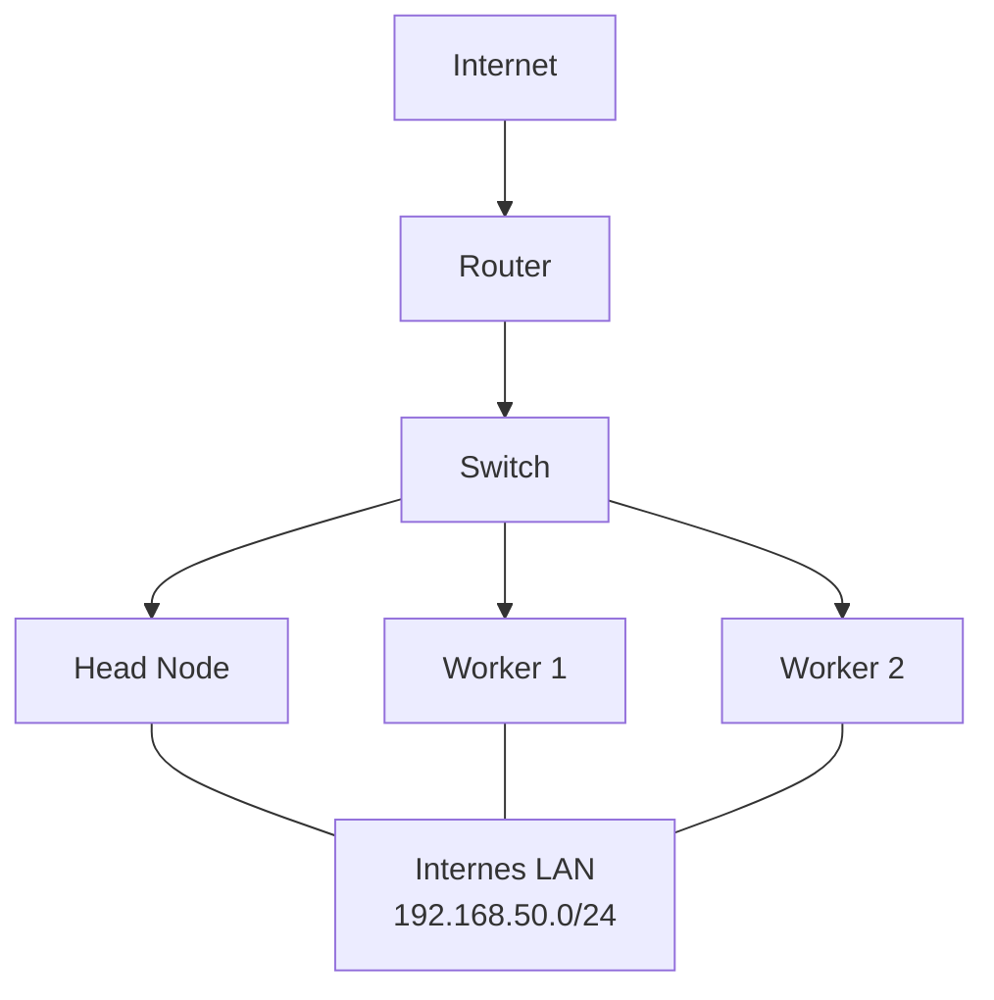
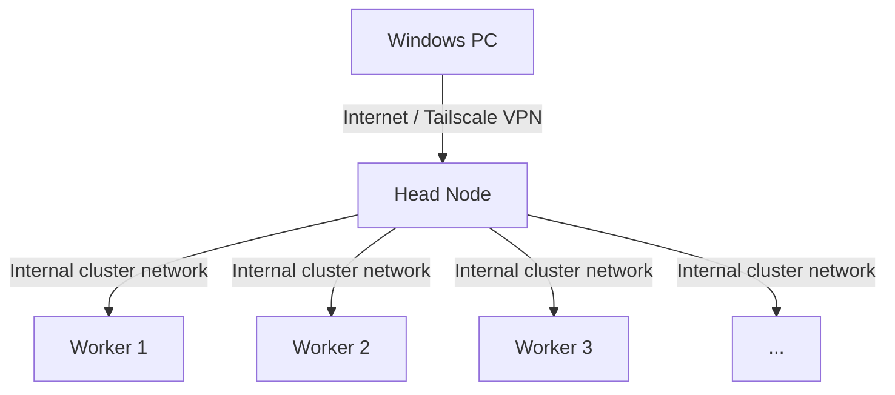
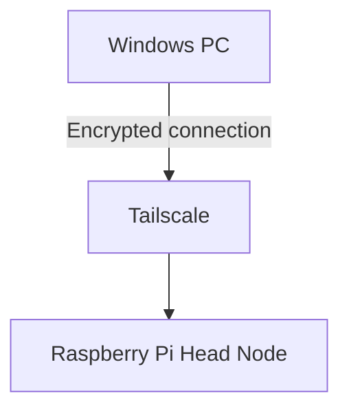
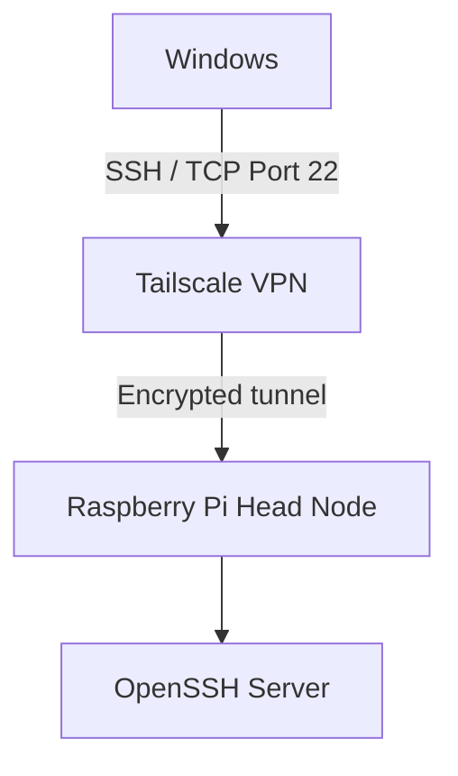
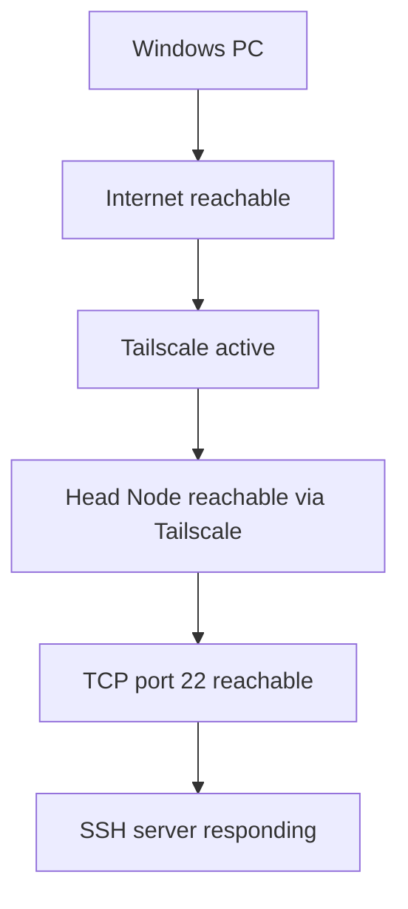
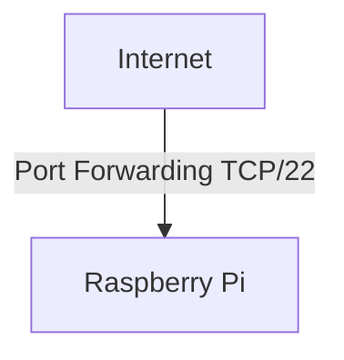
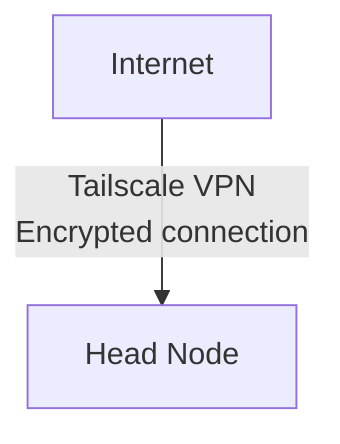
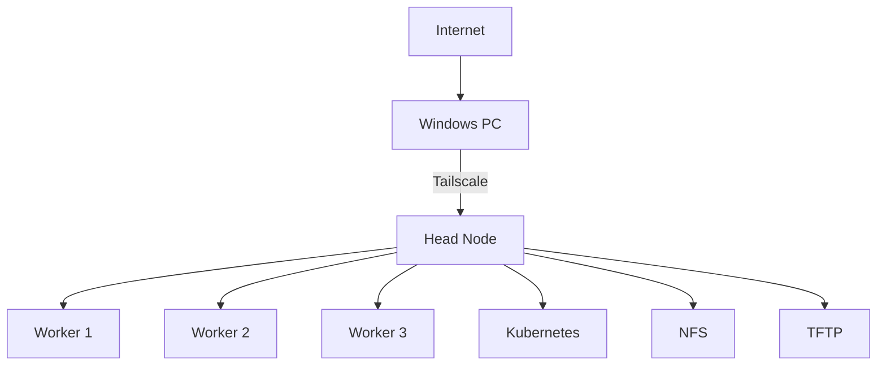
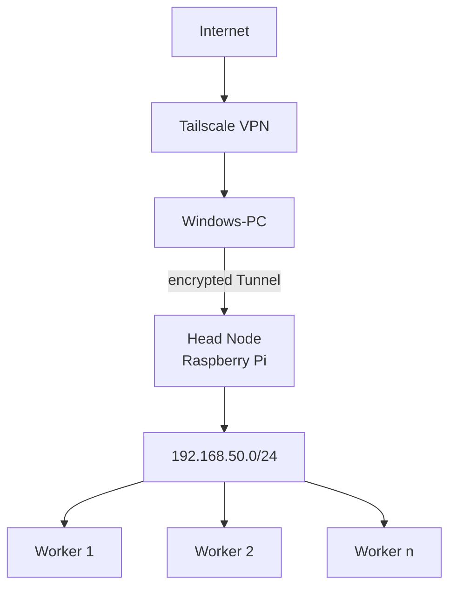

# Remote Access to the Raspberry Pi Cluster via Tailscale

---

# Table of Contents
* [1.Objective](#1-objective)
* [2.Existing Network Architecture](#2-existing-network-architecture)
* [3.Remote Access Concept](#3-remote-access-concept)
* [4.Advantages of This Solution](#4-advantages-of-this-solution)
* [5.Preparing the Head Node](#5-preparing-the-head-node)
* [6.Installing Tailscale](#6-installing-tailscale)
* [7.Connect Head Node with Tailscale](#7-connect-head-node-with-tailscale)
* [8.Checking the Tailscale Connection](#8-checking-the-tailscale-connection)
* [9.Tailscale on the Windows Client](#9-tailscale-on-the-windows-client)
* [10.SSH Access via Tailscale](#10-ssh-access-via-tailscale)

---

## 1. Objective

The objective of this configuration is to **make the head node of the Raspberry Pi cluster securely accessible over the Internet**.

The worker nodes remain exclusive within the internal cluster network. External access is only provided to the head node.

This allows the head node to serve as a central entry point for administering the cluster.

This was important so that all group members could work remotely on their assigned tasks. Initially, the cluster had to be physically set up and taken down each time. 
To enable planned automation as well as the desired remote access, we decided to use Tailscale.

Examples:

* SSH access to the head node
* Management of the worker nodes
* Administration of Kubernetes/k3s
* Management of Docker containers
* Access to internal cluster services


---

## 2. Existing Network Architecture

The Raspberry Pi cluster already has an internal network.



The Head Node already performs several central tasks within the cluster, including:

* DHCP
* TFTP
* NFS
* PXE booting of the worker nodes

The worker nodes are located within the internal network:

```text
192.168.50.0/24
```

This existing cluster network was not modified for remote access.

---

## 3. Remote Access Concept

**Tailscale** is used to provide access over the Internet.

Tailscale creates an encrypted overlay network between authorized devices. Technically, the communication is based on WireGuard.

The architecture is therefore extended to:



Only the Head Node is a member of the Tailscale network.

The Worker Nodes do not require their own Tailscale installation.

---

## 4. Advantages of This Solution

Using Tailscale eliminates the need for direct port forwarding on the router.

In particular, the following is **not required**:

* Port forwarding for SSH
* Public exposure of port 22
* A static public IPv4 address
* Dynamic DNS
* A dedicated publicly accessible VPN server
* Direct Internet accessibility of the Worker Nodes

Access is only possible from devices that have been authorized to join the private Tailscale network.


---

## 5. Preparing the Head Node

First, the local package information was updated.


```bash
sudo apt update
```

This command does not install any updates yet; it only updates the information about available packages.

Afterward, the required utility packages were installed:


```bash
sudo apt install lsb-release curl -y
```

### Used Packages

`curl`

Used to download files and information via HTTP or HTTPS.


`lsb-release`

Provides information about the Linux distribution being used.


`-y`

Automatically confirms the installation.

---

## 6. Installing Tailscale

Tailscale was installed using the official Tailscale APT repository.

First, the package source was


```text
pkgs.tailscale.com
```

was added to the system.

Additionally, the repository's signing key was configured. This allows APT to verify that the downloaded packages originate from the intended source.

After adding the repository, the package information was updated again:


```bash
sudo apt update
```

Afterward, Tailscale was installed:

```bash
sudo apt install tailscale -y
```

---

## 7. Connect Head Node with Tailscale

After the installation was completed successfully, Tailscale was started:

```bash
sudo tailscale up
```

The command generates an authentication link.

This link is opened in a browser, where the Raspberry Pi is then authorized using a Tailscale account.

After successful authentication, the head node becomes a member of the private Tailscale network.


---

## 8. Checking the Tailscale Connection

The current status can be checked on the Raspberry Pi using the following command:

```bash
tailscale status
```

A successful output may look like this:

```text
100.x.x.x    raspberrypi    <account>    linux    -
```

The address

```text
100.x.x.x
```

is the virtual Tailscale IP address of the head node.

The local IPv4 address can also be displayed directly:

```bash
tailscale ip -4
```

---

## 9. Tailscale on the Windows Client

To access the head node from a Windows PC, Tailscale must also be installed on the Windows PC.

The Windows PC is then connected to the corresponding Tailscale network.

Afterward, the Windows PC and the Raspberry Pi are logically part of the same private overlay network.



The devices do not need to be connected to the same physical network.

For example, the Windows PC can be connected through a different Internet connection or a mobile network.


---

## 10. SSH Access via Tailscale

For administration of the Head Node, standard OpenSSH is used.

Tailscale is responsible exclusively for providing the network connection.

The principle is:



On Windows, the connection can be established via PowerShell:

```powershell
ssh cloud-computing@<TAILSCALE-IP>
```

Example:

```powershell
ssh cloud-computing@100.x.x.x
```

Here:

```text
cloud-computing
```

is the username on the Raspberry Pi.

---

## 11. First SSH Connection

During the first connection, OpenSSH displays a security prompt:

```text
The authenticity of host '<IP>' can't be established.
ED25519 key fingerprint is ...
Are you sure you want to continue connecting (yes/no/[fingerprint])?
```

This message is normal during the first connection.

At this point, SSH does not yet know the Raspberry Pi's host key.

After verifying the fingerprint, the connection can be confirmed with:

```text
yes
```

The host key is then stored on the Windows PC in the `known_hosts` file.

For further connections, SSH can use this information to detect whether the server's host key has changed unexpectedly.


---

## 12. Current Status of the SSH Connection

The network connection to the Raspberry Pi via Tailscale was successfully established.

During the SSH test, the SSH server on the Raspberry Pi was reached, and the host key was successfully saved.

However, the SSH server subsequently terminated the connection:


```text
Connection closed by <TAILSCALE-IP> port 22
```

This confirms that the following components are already working:



The remaining troubleshooting therefore concerns the SSH configuration and/or SSH service on the Raspberry Pi, rather than the underlying Tailscale network connection.

For further diagnosis, the SSH service can first be checked on the Head Node:


```bash
sudo systemctl status ssh
```

Additionally, the SSH logs can be checked:

```bash
sudo journalctl -u ssh
```

---

## 13. Security Concept

A key advantage of this architecture is that the SSH port of the Head Node does not need to be exposed directly to the public Internet.

The following setup is **not** used:



Instead, the following architecture is used:



This keeps the Raspberry Pi behind the existing router/NAT system.

The worker nodes remain entirely within the private cluster network.


---

## 14. Access to the Rest of the Cluster

For the current setup, only the Head Node is made externally accessible.

After successfully logging in to the Head Node, internal systems can be administered from there.

Example:



It is therefore not necessary to make every Worker Node separately accessible over the Internet.

Kubernetes also does not need to be exposed directly to the public Internet for basic administration, as long as management is performed through the Head Node.


---

## 15. No Subnet Router Configuration Required

Tailscale also supports routing entire internal networks through a so-called Subnet Router.

For example, the Head Node could make the following network available via Tailscale:

```text
192.168.50.0/24
```

However, this is not necessary for the current setup.

The goal is solely to enable:

```text
Internet -> Tailscale -> Head Node
```

The Worker Nodes remain behind the Head Node and/or within the existing cluster network.


---

## 16. Summary

A secure remote access solution via Tailscale has been set up for the Raspberry Pi cluster.

The existing cluster infrastructure did not need to be modified for this purpose.

In addition to its local network address, the Head Node has a virtual Tailscale IP address, making it accessible over the Internet from authorized Tailscale devices.

The final architecture is as follows:



This fulfills the following requirements:

* Head Node accessible over the Internet
* Encrypted communication
* No need to expose SSH publicly
* No Dynamic DNS required
* No static public IPv4 address required
* No changes to the internal PXE/NFS network
* Worker Nodes remain isolated from the public Internet
* Centralized cluster administration through the Head Node

## Status

**Tailscale connection: successfully configured**

**Head Node accessible via Tailscale: successful**

**SSH port of the Head Node is reachable: successful**

**SSH login: further configuration/troubleshooting required**